# Class Diagram

## Extras

- Preço variante (fazer um gráfico de preços)
- Coupon
- Cenas do delivery(?)

## TODOS

- [ ] Notifications
- [ ] Payments
- [ ] Credentials
- [ ] `Product#image` or `ProductSpecification#image`?
- [ ] Class Methods
- [ ] Delivery
  > RF-21: Criação, edição, e remoção de veículo de transporte de produtos.
  - [ ] Cada fornecedor entrega a sua parte da `Order` (os seus `OrderItem`)
  - [ ] um/múltiplos serviços externos de entrega (DHL, CTT)
  - [ ] Ambos, e mostrar o impacto ambiental/whatever na comunidade local

```mermaid
classDiagram
    %% TB is also readable
    direction LR
    Order "*" -- "1" Coupon
    DeliveryStatus "1" -- "*" DeliveryStatusUpdate
    Address "1" -- "*" DeliveryStatusUpdate
    DeliveryStatusUpdate "*" -- "1" Order
    Address "*" -- "*" User
    User -- UserType
    User <|-- Consumer
    User <|-- Producer
    Consumer "1" -- "*" Order
    FieldPossibleValue "*" -- "1" Field
    ProductSpecificationFieldValue "*" -- "*" Field
    Order "1" -- "*" OrderItem
    Product "1" -- "*" OrderItem
    Producer "1" -- "*" Product
    Product "1" -- "*" ProductPricing
    Product "*" -- "1" ProductSpecification
    ProductSpecification "1" -- "*" ProductSpecificationCategory
    ProductSpecificationCategory "1" -- "*" ProductSpecificationFieldValue
    ProductSpecificationCategory "*" -- "1" Category
    Field "*" -- "*" Category
    Category "1" -- "*" Category
    Field -- FieldType

    class User {
        <<abstract>>
        -int id
        -String name
        -String email
        -int phone
        -int vat
        -List~Address~ addresses
        -UserType type
        -Date createdAt
        -Date updatedAt
        -Date deletedAt
        +getName() String
        +setName(String name)
        +getEmail() String
        +setEmail(String email)
        +getPhone() int
        +setPhone(int phone)
        +getVat() int
        +setVat(int vat)
        +getCreatedAt() Date
        +getUpdatedAt() Date
        +getDeletedAt() Date
    }

    class Consumer {
        -UserType type = CONSUMER
    }

    class Producer {
        -UserType type = PRODUCER
    }

    class UserType {
        <<enum>>
        + CONSUMER
        + PRODUCER
    }

    class Address {
        -int id
        -int number
        -String street
        -String zipCode
        -String city
        -String county
        -String district
        -String country
        -double latitude
        -double longitude
        -Date createdAt
        -Date updatedAt
        -Date deletedAt
        +getNumber() int
        +setNumber(int number)
        +getStreet() String
        +setStreet(String street)
        +getZipCode() String
        +setZipCode(String zipCode)
        +getCity() String
        +setCity(String city)
        +getCounty() String
        +setCounty(String county)
        +getDistrict() String
        +setDistrict(String district)
        +getCountry() String
        +setCountry(String country)
        +getLatitude() double
        +setLatitude(double latitude)
        +getLongitude() double
        +setLongitude(double longitude)
        +getCreatedAt() Date
        +getUpdatedAt() Date
        +getDeletedAt() Date
    }

    class Order {
        -int id
        -Consumer consumer
        -double totalPrice
        -Coupon coupon
        -Address deliveryAddress
        -List~OrderItem~ items
        -List~DeliveryStatusUpdates~ deliveryStatuses
        -Date createdAt
        -Date updatedAt
        -Date deletedAt
        +getId() int
        +getConsumer() Consumer
        +getTotalPrice() double
        +getCoupon() Coupon
        +getDeliveryAddress() Address
        +getCreatedAt() Date
        +getUpdatedAt() Date
        +getDeletedAt() Date
    }

    class OrderItem {
        -Order order
        -Product product
        -double price
        -int quantity
        +getOrder() Order
        +getProduct() Product
        +getQuantity() int
    }

    class DeliveryStatusUpdate {
        -Order order
        -DeliveryStatus status
        -Address location
        -Date createdAt
        -Date updatedAt
        -Date deletedAt
        +getOrder() Order
        +getStatus() DeliveryStatus
        +getCreatedAt() Date
    }

    class DeliveryStatus {
        -int id
        -String name
        -String description
    }    

    class Coupon {
        -int id
        -String code
        -double discount
        -Date createdAt
        -Date updatedAt
        -Date deletedAt
        +getCode() String
        +getDiscount() double
        +getCreatedAt() Date
        +getUpdatedAt() Date
        +getDeletedAt() Date
    }

    class Product {
        -int id
        -Producer producer
        -ProductSpecification specification
        -double currentPrice
        -List~ProductPricing~ pricing
        -Date productionDate
        -Date createdAt
        -Date updatedAt
        -Date deletedAt
        +getProducer() Producer
        +getSpecification() ProductSpecification
        +getCurrentPrice() double
        +getOldPrices() List~double~
        +getProductionDate() Date
        +getCreatedAt() Date
        +getUpdatedAt() Date
        +getDeletedAt() Date
    }

    class ProductPricing {
        -int id
        -Product product
        -double price
        -Date createdAt
        -Date updatedAt
        -Date deletedAt
        +getProduct() Product
        +getPrice() double
        +getCreatedAt() Date
        +getUpdatedAt() Date
        +getDeletedAt() Date
    }

    class ProductSpecification {
        -int id
        -String name
        -String description
        -String image
        -List~Product~ products
        -List~Category~ categories
        -Date createdAt
        -Date updatedAt
        -Date deletedAt
        +getName() String
        +setName(String name)
        +getDescription() String
        +setDescription(String description)
        +getImage() String
        +setImage(String image)
        +getCreatedAt() Date
        +getUpdatedAt() Date
        +getDeletedAt() Date
    }

    class ProductSpecificationCategory {
        -ProductSpecification specification
        -Category category
        -List~ProductSpecificationFieldValue~ values
        +getSpecification() ProductSpecification
        +getCategory() Category
        +getCreatedAt() Date
        +getUpdatedAt() Date
        +getDeletedAt() Date
    }

    class Category {
        -int id
        -String name
        -Category parentCategory
        -List~Category~ subCategories
        -List~Field~ fields
        -Date createdAt
        -Date updatedAt
        -Date deletedAt
        +getName() String
        +setName(String name)
        +getParentCategory() Category
    }

    class FieldType {
        <<enum>>
        + TEXT
        + NUMBER
        + DATE
        + BOOLEAN
        + ENUM
    }

    class Field {
        -int id
        -String name
        -FieldType type
        -String unit
        -List~FieldPossibleValue~ possibleValues
        -List~Category~ categories
        -Date createdAt
        -Date updatedAt
        -Date deletedAt
    }

    class FieldPossibleValue {
        -Field field
        -String value
        +getField() Field
        +getValue() String
    }

    class ProductSpecificationFieldValue {
        -ProductSpecification productSpecification
        -Field field
        -String value
        +getProductSpecification() ProductSpecification
        +getField() Field
        +getValue() String
    }

```

