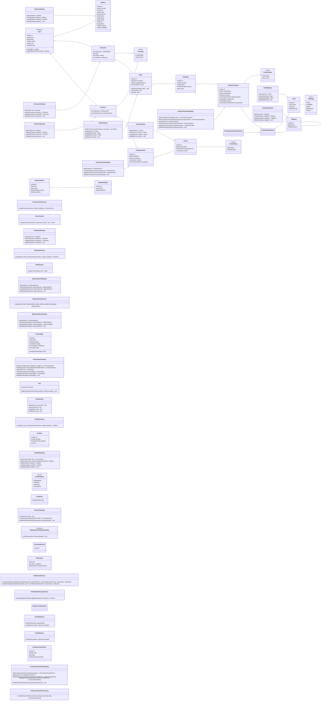

# Diagrama de classes

```mermaid
classDiagram
    %% TB is also readable
    direction LR
    User "*" -- "*" Address
    User <|-- Consumer
    User <|-- Producer

    AddressGateway --|> Address
    ProducerGateway --|> Producer
    ConsumerGateway --|> Consumer
    OrderGateway --|> Order
    ProductionUnitGateway --|> ProductionUnit
    CarrierGateway --|> Carrier
    ProducerProductGateway --|> ProducerProduct
    ProductSpecificationGateway --|> ProductSpecification
    FieldGateway --|> Field
    CategoryGateway --|> Category

    Consumer "*" -- "1" UserType
    Consumer "1" -- "*" Order

    Producer "*" -- "1" UserType
    Producer "1" -- "*" ProductionUnit

    ProductionUnit "1" -- "*" Carrier

    Carrier "*" -- "1" CarrierStatus

    OrderItem "1" -- "1" ProducerProduct
    Order "1" -- "*" OrderItem

    ShipmentEvent "*" -- "1" ShipmentStatus

    ProducerProduct "*" -- "1" ProductStatus
    ProducerProduct "*" -- "1" ProductSpecification

    ProductSpecification "*" -- "*" Field
    ProductSpecification "*" -- "*" Category

    Category "*" -- "1" Category

    Field "*" -- "1" FieldType


    class User {
        <<abstract>>
        -number id
        -string name
        -string email
        -number phone
        -number vat
        -UserType type
        
        +canLogin() boolean
        %% TODO separate table?
        +getNotificationPreferences() unknown
    }

    class Consumer {
        -UserType type = CONSUMER
        -Cart cart
        -List~Order~ orders
        -List~Address~ addresses
    }

    class ConsumerGateway {
        +get(number id) Consumer
        +insert(Consumer consumer) Consumer
        +update(Consumer consumer) Consumer
        +delete(Consumer consumer) void
    }

    class Producer {
        -UserType type = PRODUCER
        List~ProductionUnit~ productionUnits
    }

    class ProducerGateway {
        +get(number id) Producer
        +insert(Producer producer) Producer
        +update(Producer producer) Producer
        +delete(Producer producer) void
    }

    class UserType {
        <<enum>>
        +CONSUMER
        +PRODUCER
    }

    class Address {
        -number id
        -number number
        -string door
        -number floor
        -string zipCode
        -string street
        -string parish
        -string county
        -string city
        -string district
        -number latitude
        -number longitude
    }

    class AddressGateway {
        +get(number id) Address
        +insert(Address address) Address
        +update(Address address) Address
        +delete(Address address) void
    }

    class ProductionUnit {
        -number id
        -Address address
        -Producer producer
        -List~Carrier~ carriers
        -List~ProducerProduct~ products
    }

    class ProductionUnitGateway {
        +get(number id) ProductionUnit
        +insert(ProductionUnit productionUnit) ProductionUnit
        +update(ProductionUnit productionUnit) ProductionUnit
        +delete(ProductionUnit productionUnit) void
    }

    class ProductionUnitFactory {
        +create(Producer producer, Address address) ProductionUnit
    }

    class Carrier {
        -number id
        -string licensePlate
        -ProductionUnit productionUnit
        -CarrierStatus status
    }

    class CarrierGateway {
        +get(number id) Carrier
        +insert(Carrier carrier) Carrier
        +update(Carrier carrier) Carrier
        +delete(Carrier carrier) void
    }

    class CarrierFactory {
        +create(Producer producer, string name, string ...etc) Carrier
    }

    %% TODO: isto ser calculado em vez de ser definido
    class CarrierStatus {
        <<enum>>
        +AVAILABLE
        +UNAVAILABLE
    }

    class OrderItem {
        -number id
        -number quantity
        -number price
        -ProducerProduct product
        -Order order
    }

    %% TODO: necessário?
    class OrderItemGateway {
        +get(number id) OrderItem
        +insert(OrderItem orderItem) OrderItem
        +update(OrderItem orderItem) OrderItem
        +delete(OrderItem orderItem) void
    }

    class OrderItemFactory {
        +create(Order order, ProducerProduct product, number quantity) OrderItem
    }

    class Order {
        -number id
        -Consumer consumer
        -Address shippingAddress
        -List~OrderItem~ items
        +addItem(OrderItem item) void
        +canCancel() void
        +cancel() void
    }

    class OrderGateway {
        +findFromConsumer(Consumer consumer) List~Order~
        +get(number id) Order
        +insert(Order order) Order
        +update(Order order) Order
        +delete(Order order) void
    }

    class OrderFactory {
        +createFromCart(Cart cart) Order
    }

    class ShipmentEvent {
        -number id
        -Date date
        -Order order
        -ShipmentStatus status
        -Address address
    }

    class ShipmentEventGateway {
        +get(number id) ShipmentEvent
        +insert(ShipmentEvent shipmentEvent) ShipmentEvent
        +update(ShipmentEvent shipmentEvent) ShipmentEvent
        +delete(ShipmentEvent shipmentEvent) void
    }

    class ShipmentEventFactory {
        +create(Order order, ShipmentStatus status, Address address, Date date) ShipmentEvent
    }

    %% TODO representa os tipos de shipment status: "em preparação", "em transporte", "entregue", etc
    class ShipmentStatus {
        -number id
        -string name
        -string description
    }

    %% TODO: necessário? só se for para o admin
    class ShipmentStatusGateway {
        +get(number id) ShipmentStatus
        +insert(ShipmentStatus shipmentStatus) ShipmentStatus
        +update(ShipmentStatus shipmentStatus) ShipmentStatus
        +delete(ShipmentStatus shipmentStatus) void
    }

    class ProducerProduct {
        %% O id tecnicamente é uma composição de id da ProductSpec e do Producer
        -number id
        -number currentPrice
        -Date productionDate
        -Producer producer
        -List~ProductionUnit~ productionUnits
        -ProductSpec specification
        %% TODO: devemos calcular em vez de guardar?
        -ProductStatus status
        -List~ProducerProductPrice~ priceHistory
    }

    class ProducerProductGateway {
        +findFromSpec(ProductSpec spec) List~ProducerProduct~
        +findFromProductionUnit(ProductionUnit productionUnit) List~ProducerProduct~
        +get(number id) ProducerProduct
        +insert(ProducerProduct producerProduct) ProducerProduct
        +update(ProducerProduct producerProduct) ProducerProduct
        +delete(ProducerProduct producerProduct) void
    }

    class ProductSpec {
        -number id
        -string name
        -string description
        -List~string~ images
        -List~Category~ categories
        %% TODO fieldvalues
        -List~Field~ fields
        +compare(ProductSpec other)
    }

    class ProductSpecGateway {
        +findFromCategory(List~Category~ category) List~ProductSpec~
        +find(string query, ProductSpecSearchFilter filter) List~ProductSpec~
        +get(number id) ProductSpec
        +insert(ProductSpec productSpec) ProductSpec
        +update(ProductSpec productSpec) ProductSpec
        +delete(ProductSpec productSpec) void
    }

    class ProductStatus {
        <<enum>>
        +AVAILABLE
        +SOLD_OUT
    }

    class Category {
        -number id
        -string name
        -Category parent
        %% TODO fields, subCategories?
    }
    
    class CategoryGateway {
        +get(number id) Category
        +insert(Category category) Category
        +update(Category category) Category
        +delete(Category category) void
    }

    class Field {
        -number id
        -string name
        -string unit
        -FieldType type
        %% TODO possible values
    }

    class FieldGateway {
        +get(number id) Field
        +insert(Field field) Field
        +update(Field field) Field
        +delete(Field field) void
    }

    class FieldType{
        <<enum>>
        +TEXT
        +NUMBER
        +DATE
        +BOOLEAN
        +ENUM
    }

    class Cart {
        %% o id é o mesmo que o do consumidor
        -Consumer consumer
        +addProduct(ProducerProduct product, number quantity) void
    }

    class CartGateway {
        +get(number consumerId) Cart
        +insert(Cart cart) Cart
        +update(Cart cart) Cart
        +delete(Cart cart) void
    }

    class CartItemFactory {
        +create(Cart cart, ProducerProduct product, number quantity) CartItem
    }

    class CartItem {
        %% tecnicamente é uma combinação dos ids do producerProduct e do cart
        -number id
        -number quantity
        -ProducerProduct product
        -Cart cart
    }

    class CartItemGateway {
        +findFromCart(Cart cart) List~CartItem~
        +get(number cartId, number producerProductId) CartItem
        +insert(CartItem cartItem) CartItem
        +update(CartItem cartItem) CartItem
        +delete(CartItem cartItem) void
    }

    %% TODO verificar com o prof
    class CredentialType {
        <<enum>>
        +PASSWORD
        +GOOGLE
        +TWITTER
        +FACEBOOK
    }

    class Credential {
        -CredentialType type
    }

    class PaymentGateway {
        +refund(Order order) void
        +createCheckoutSession(Order order) CheckoutSession
        %% TODO: definir Strategies que tratem de cada tipo de webhook event que recebermos
        +handleWebhookEvent(string payload, string sigHeader) void
    }

    class WebhookEventHandlerStrategy {
        <<interface>>
        +run(string payload, string sigHeader) void
    }

    class CheckoutSession {
        -string url
    }

    %% TODO perguntar ao prof se é necessário já que temos o shipmentevent
    class Notification {
        %% user that triggered the notification
        -User actor
        -List~User~ recipients
        %% the entity that the notification is about
        -ShipmentEvent shipmentEvent
    }

    %% TODO separate into socket and email classes? maybe strategy?
    class NotificationFactory {
        +createSocketShipmentNotification(ShipmentEvent shipmentEvent, List~NotificationSubscriber~ subscribers) Notification
        +createEmailShipmentNotification(Order order, List~NotificationSubscriber~ subscribers) Notification
    }

    class NotificationMessageFactory {
        +makeShippingSocketMessage(ShipmentEvent shipment) unknown
    }

    %% TODO - these are the users that will receive the notification
    class NotificationSubscriber {

    }

    %% This is not a database gateway
    class SocketGateway {
        +findSocket(number subscriberId)
        +send(Socket socket, unknown message)
    }

    %% This is not a database gateway
    class EmailGateway {
        +send(string address, unknown message)
    }

    class ProducerProductPrice {
        -number id
        -number price
        -Date date
        -ProducerProduct product
    }

    class ProducerProductPriceGateway {
        %% TODO needed or loaded from producerproduct?
        +findFromProduct(ProducerProduct product) List~ProducerProductPrice~
        +get(number id) ProducerProductPrice
        +insert(ProducerProductPrice producerProductPrice) ProducerProductPrice
        +update(ProducerProductPrice producerProductPrice) ProducerProductPrice
        +delete(ProducerProductPrice producerProductPrice) void
    }

    class ProducerProductPriceFactory {
        +create(ProducerProduct product, number price, Date date) ProducerProductPrice
    }
```
