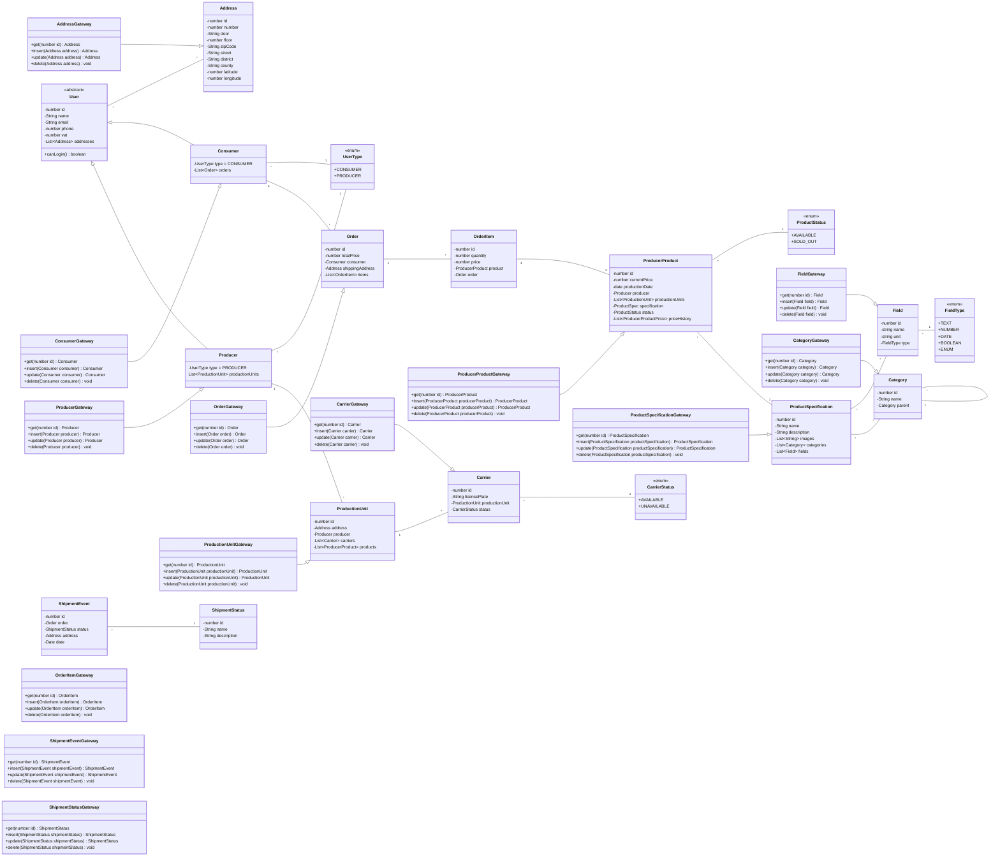

# Diagrama de classes

```mermaid
classDiagram
    %% TB is also readable
    direction LR
    User "*" -- "*" Address
    User <|-- Consumer
    User <|-- Producer

    AddressGateway --|> Address
    ProducerGateway --|> Producer
    ConsumerGateway --|> Consumer
    OrderGateway --|> Order
    ProductionUnitGateway --|> ProductionUnit
    CarrierGateway --|> Carrier
    ProducerProductGateway --|> ProducerProduct
    ProductSpecificationGateway --|> ProductSpecification
    FieldGateway --|> Field
    CategoryGateway --|> Category

    Consumer "*" -- "1" UserType
    Consumer "1" -- "*" Order

    Producer "*" -- "1" UserType
    Producer "1" -- "*" ProductionUnit

    ProductionUnit "1" -- "*" Carrier

    Carrier "*" -- "1" CarrierStatus

    OrderItem "1" -- "1" ProducerProduct
    Order "1" -- "*" OrderItem

    ShipmentEvent "*" -- "1" ShipmentStatus

    ProducerProduct "*" -- "1" ProductStatus
    ProducerProduct "*" -- "1" ProductSpecification

    ProductSpecification "*" -- "*" Field
    ProductSpecification "*" -- "*" Category

    Category "*" -- "1" Category

    Field "*" -- "1" FieldType


    class User {
        <<abstract>>
        -number id
        -String name
        -String email
        -number phone
        -number vat
        -List~Address~ addresses
        
        +canLogin() boolean
    }

    class Consumer {
        -UserType type = CONSUMER
        -List~Order~ orders
    }

    class ConsumerGateway {
        +get(number id) Consumer
        +insert(Consumer consumer) Consumer
        +update(Consumer consumer) Consumer
        +delete(Consumer consumer) void
    }

    class Producer {
        -UserType type = PRODUCER
        List~ProductionUnit~ productionUnits
    }

    class ProducerGateway {
        +get(number id) Producer
        +insert(Producer producer) Producer
        +update(Producer producer) Producer
        +delete(Producer producer) void
    }

    class UserType {
        <<enum>>
        +CONSUMER
        +PRODUCER
    }

    class Address {
        -number id
        -number number
        -String door
        -number floor
        -String zipCode
        -String street
        -String district
        -String county
        -number latitude
        -number longitude
    }

    class AddressGateway {
        +get(number id) Address
        +insert(Address address) Address
        +update(Address address) Address
        +delete(Address address) void
    }

    class ProductionUnit {
        -number id
        -Address address
        -Producer producer
        -List~Carrier~ carriers
        -List~ProducerProduct~ products
    }

    class ProductionUnitGateway {
        +get(number id) ProductionUnit
        +insert(ProductionUnit productionUnit) ProductionUnit
        +update(ProductionUnit productionUnit) ProductionUnit
        +delete(ProductionUnit productionUnit) void
    }

    class Carrier {
        -number id
        -String licensePlate
        -ProductionUnit productionUnit
        -CarrierStatus status
    }

    class CarrierGateway {
        +get(number id) Carrier
        +insert(Carrier carrier) Carrier
        +update(Carrier carrier) Carrier
        +delete(Carrier carrier) void
    }

    %% TODO: isto ser calculado em vez de ser definido
    class CarrierStatus {
        <<enum>>
        +AVAILABLE
        +UNAVAILABLE
    }

    class OrderItem {
        -number id
        -number quantity
        -number price
        -ProducerProduct product
        -Order order
    }

    %% TODO: necessário?
    class OrderItemGateway {
        +get(number id) OrderItem
        +insert(OrderItem orderItem) OrderItem
        +update(OrderItem orderItem) OrderItem
        +delete(OrderItem orderItem) void
    }

    class Order {
        -number id
        -number totalPrice
        -Consumer consumer
        -Address shippingAddress
        -List~OrderItem~ items
        %% TODO: devemos calcular em vez de guardar?
    }

    class OrderGateway {
        +get(number id) Order
        +insert(Order order) Order
        +update(Order order) Order
        +delete(Order order) void
    }

    class ShipmentEvent{
        -number id
        -Order order
        -ShipmentStatus status
        -Address address
        -Date date
    }

    class ShipmentEventGateway {
        +get(number id) ShipmentEvent
        +insert(ShipmentEvent shipmentEvent) ShipmentEvent
        +update(ShipmentEvent shipmentEvent) ShipmentEvent
        +delete(ShipmentEvent shipmentEvent) void
    }

    class ShipmentStatus{
        -number id
        -String name
        -String description
    }

    %% TODO: necessário? só se for para o admin
    class ShipmentStatusGateway {
        +get(number id) ShipmentStatus
        +insert(ShipmentStatus shipmentStatus) ShipmentStatus
        +update(ShipmentStatus shipmentStatus) ShipmentStatus
        +delete(ShipmentStatus shipmentStatus) void
    }

    class ProducerProduct {
        -number id
        -number currentPrice
        -date productionDate
        -Producer producer
        -List~ProductionUnit~ productionUnits
        -ProductSpec specification
        %% TODO: devemos calcular em vez de guardar?
        -ProductStatus status
        -List~ProducerProductPrice~ priceHistory
    }

    class ProducerProductGateway {
        +get(number id) ProducerProduct
        +insert(ProducerProduct producerProduct) ProducerProduct
        +update(ProducerProduct producerProduct) ProducerProduct
        +delete(ProducerProduct producerProduct) void
    }

    class ProductSpecification {
        -number id
        -String name
        -String description
        -List~String~ images
        -List~Category~ categories
        %% TODO fieldvalues
        -List~Field~ fields
    }

    class ProductSpecificationGateway {
        +get(number id) ProductSpecification
        +insert(ProductSpecification productSpecification) ProductSpecification
        +update(ProductSpecification productSpecification) ProductSpecification
        +delete(ProductSpecification productSpecification) void
    }

    class ProductStatus{
        <<enum>>
        +AVAILABLE
        +SOLD_OUT
    }

    class Category{
        -number id
        -String name
        -Category parent
        %% TODO fields, subCategories?
    }
    
    class CategoryGateway {
        +get(number id) Category
        +insert(Category category) Category
        +update(Category category) Category
        +delete(Category category) void
    }

    class Field{
        -number id
        -string name
        -string unit
        -FieldType type
        %% TODO possible values
    }

    class FieldGateway {
        +get(number id) Field
        +insert(Field field) Field
        +update(Field field) Field
        +delete(Field field) void
    }

    class FieldType{
        <<enum>>
        +TEXT
        +NUMBER
        +DATE
        +BOOLEAN
        +ENUM
    }
```
