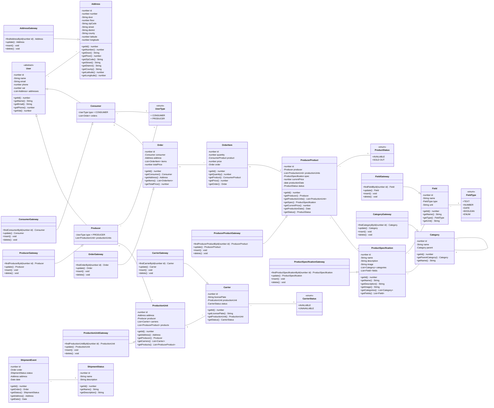

```mermaid
classDiagram
    %% TB is also readable
    direction LR
    User "*" -- "*" Address
    User <|-- Consumer
    User <|-- Producer

    AddressGateway --|> Address
    ProducerGateway --|> Producer
    ConsumerGateway --|> Consumer
    OrderGateway --|> Order
    ProductionUnitGateway --|> ProductionUnit
    CarrierGateway --|> Carrier
    ProducerProductGateway --|> ProducerProduct
    ProductSpecificationGateway --|> ProductSpecification
    FieldGateway --|> Field
    CategoryGateway --|> Category

    Consumer "*" -- "1" UserType
    Consumer "1" -- "*" Order

    Producer "*" -- "1" UserType
    Producer "1" -- "*" ProductionUnit

    ProductionUnit "1" -- "*" Carrier

    Carrier "*" -- "1" CarrierStatus

    OrderItem "1" -- "1" ProducerProduct
    Order "1" -- "*" OrderItem

    ShipmentEvent "*" -- "1" ShipmentStatus

    ProducerProduct "*" -- "1" ProductStatus
    ProducerProduct "*" -- "1" ProductSpecification

    ProductSpecification "*" -- "*" Field
    ProductSpecification "*" -- "*" Category

    Category "*" -- "1" Category

    Field "*" -- "1" FieldType


    class User {
        <<abstract>>
        -number id
        -String name
        -String email
        -number phone
        -number vat
        -List~Address~ addresses

        +getId() number
        +getName() String
        +getEmail() String
        +getPhone() number
        +getVat() number
        
    }

    class Consumer {
        -UserType type = CONSUMER
        -List~Order~ orders
    }

    class ConsumerGateway{
        +findConsumerById(number id) Consumer
        +update() Consumer
        +insert() void
        +delete() void
    }

    class Producer {
        -UserType type = PRODUCER
        List~ProductionUnit~ productionUnits
    }

    class ProducerGateway{
        +findProducerById(number id) Producer
        +update() Producer
        +insert() void
        +delete() void
    }

    class UserType {
        <<enum>>
        + CONSUMER
        + PRODUCER
    }

    class Address{
        -number id
        -number number
        -String door
        -number floor
        -String zipCode
        -String street
        -String district
        -String county
        -number latitude 
        -number longitude

        +getId() number
        +getNumber() number
        +getDoor() String
        +getFloor() number
        +getZipCode() String
        +getStreet() String
        +getDistrict() String
        +getCounty() String
        +getLatitude() number
        +getLongitude() number
    }

    class AddressGateway{
        +findAddressById(number id) Address
        +update() Address
        +insert() void
        +delete() void

    }

    class ProductionUnit{
        -number id
        -Address address
        -Producer producer
        -List~Carrier~ carriers
        -List~ProducerProduct~ products

        +getId() number
        +getAddress() Address
        +getProducer() Producer
        +getCarriers() List~Carrier~
        +getProducts() List~ProducerProduct~
    
    }

    class ProductionUnitGateway{
        +findProductionUnitById(number id) ProductionUnit
        +update() ProductionUnit
        +insert() void
        +delete() void
    }

    class Carrier{
        -number id
        -String licensePlate
        -ProdcutionUnit productionUnit
        -CarrierStatus status

        +getId() number
        +getLicensePlate() String
        +getProductionUnit() ProductionUnit
        +getStatus() CarrierStatus
    }

    class CarrierGateway{
        +findCarrierById(number id) Carrier
        +update() Carrier
        +insert() void
        +delete() void
    }

    class CarrierStatus{
        <<enum>>
        +AVAILABLE
        +UNAVAILABLE
    }

    class OrderItem{
        -number id
        -number quantity
        -ConsumerProduct product
        -number price
        -Order order

        +getId() number
        +getQuantity() number
        +getProduct() ConsumerProduct
        +getPrice() number
        +getOrder() Order
    }

    class Order{
        -number id
        -Consumer consumer
        -Address address
        -List~OrderItem~ items
        -number totalPrice
        
        +getId() number
        +getConsumer() Consumer
        +getAddress() Address
        +getItems() List~OrderItem~
        +getTotalPrice() number

    }

    class OrderGateway{
        +findOrderById(number id) Order
        +update() Order
        +insert() void
        +delete() void
    }

    class ShipmentEvent{
        -number id
        -Order order
        -ShipmentStatus status
        -Address address
        -Date date

        +getId() number
        +getOrder() Order
        +getStatus() ShipmentStatus
        +getAddress() Address
        +getDate() Date
    }

        
    class ShipmentStatus{
        -number id
        -String name
        -String description

        +getId() number
        +getName() String
        +getDescription() String
    }

    class ProducerProduct{
        -number id
        -Producer producer
        -List~ProductionUnit~ productionUnits
        -ProductSpecification spec  
        -number currentPrice
        -date productionDate
        -ProductStatus status

        +getId() number
        +getProducer() Producer
        +getProductionUnits() List~ProductionUnit~
        +getSpec() ProductSpecification
        +getCurrentPrice() number
        +getProductionDate() Date
        +getStatus() ProductStatus

    }

    class ProducerProductGateway{
        +findProducerProductById(number id) ProducerProduct
        +update() ProducerProduct
        +insert() void
        +delete() void
    }

    class ProductSpecification{
        -number id
        -String name
        -String description
        -String image
        -List~Category~ categories
        -List~Field~ fields

        +getId() number
        +getName() String
        +getDescription() String
        +getImage() String
        +getCategories() List~Category~
        +getFields() List~Field~
    }

    class ProductSpecificationGateway{
        +findProductSpecificationById(number id) ProductSpecification
        +update() ProductSpecification
        +insert() void
        +delete() void
    }

    class ProductStatus{
        <<enum>>
        +AVAILABLE
        +SOLD OUT   
    }

    class Category{
        -number id
        -String name
        -Category parent

        +getId() number
        +getParentCategory() Category
        +getName() String

    }
    
    class CategoryGateway{
        +findCategoryById(number id) Category
        +update() Category
        +insert() void
        +delete() void
    }

    class Field{
        -number id
        -String name
        -FieldType type
        -String unit

        +getId() number
        +getName() String
        +getType() FieldType
        +getUnit() String
    }

    class FieldGateway{
        +findFieldById(number id) Field
        +update() Field
        +insert() void
        +delete() void
    }

    class FieldType{
        <<enum>>
        +TEXT
        +NUMBER
        +DATE
        +BOOLEAN
        +ENUM
    }
```