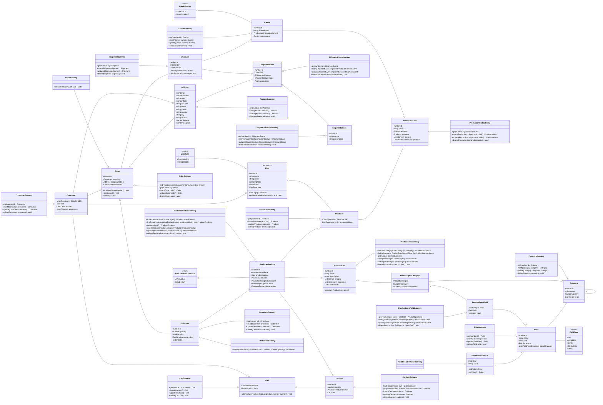

# Diagrama de classes

```mermaid
classDiagram
    direction LR

    UserType --|> User
    User <|-- Producer
    Consumer --|> User
    ConsumerGateway --|> Consumer
    Consumer --|> Address
    ProducerGateway --|> Producer

    Address <|-- AddressGateway

    ShipmentGateway --|> Shipment
    Order <|-- Shipment
    Shipment --|> ShipmentEvent
    ShipmentEvent <|-- ShipmentEventGateway
    ShipmentEvent <|-- ShipmentStatus
    ShipmentStatusGateway --|> ShipmentStatus
    Address <|-- ShipmentEvent
    CarrierStatus <|-- Carrier
    CarrierGateway --|> Carrier
    Shipment --|> Carrier
    Carrier --|> ProductionUnit
    Order <|-- OrderGateway

    ProductionUnit <|-- ProductionUnitGateway
    Producer --|> ProductionUnit

    ProducerProductGateway --|> ProducerProduct
    ProducerProduct --|> Producer
    ProducerProductStatus <|-- ProducerProduct

    OrderItem <|-- OrderItemGateway

    ProducerProduct --|> ProductSpec
    ProductSpec <|-- ProductSpecGateway

    CategoryGateway --|> Category
    ProductSpec <|-- ProductSpecCategory
    ProductSpecCategory "1" -- "*" ProductSpecField
    ProductSpecCategory "*" -- "1" Category
    Field "*" -- "*" Category
    Category "1" -- "*" Category
    Field -- FieldType
    ProductSpecField "*" -- "*" Field
    FieldGateway --|> Field
    ProductSpecFieldGateway --|> ProductSpecField
    FieldPossibleValue "*" -- "1" Field
    FieldPossibleValueGateway --|> FieldPossibleValue

    OrderItem <|-- OrderItemFactory
    Consumer --|> Cart
    ProducerProduct --|> CartItem
    Cart <|-- CartItem
    CartItem <|-- CartItemGateway
    CartGateway --|> Cart

    OrderFactory --|> Order
    Order <|-- OrderItem
    OrderItem --|> ProducerProduct
    Consumer --|> Order
    Order <|-- Address

    class User {
        <<abstract>>
        -number id
        -string name
        -string email
        -number phone
        -number vat
        -UserType type
        
        +canLogin() boolean
        +getNotificationPreferences() unknown
    }

    class Consumer {
        -UserType type = CONSUMER
        -Cart cart
        -List~Order~ orders
        -List~Address~ addresses
    }

    class ConsumerGateway {
        +get(number id) Consumer
        +insert(Consumer consumer) Consumer
        +update(Consumer consumer) Consumer
        +delete(Consumer consumer) void
    }

    class Producer {
        -UserType type = PRODUCER
        List~ProductionUnit~ productionUnits
    }

    class ProducerGateway {
        +get(number id) Producer
        +insert(Producer producer) Producer
        +update(Producer producer) Producer
        +delete(Producer producer) void
    }

    class UserType {
        <<enum>>
        +CONSUMER
        +PRODUCER
    }

    class Address {
        -number id
        -number number
        -string door
        -number floor
        -string zipCode
        -string street
        -string parish
        -string county
        -string city
        -string district
        -number latitude
        -number longitude
    }

    class AddressGateway {
        +get(number id) Address
        +insert(Address address) Address
        +update(Address address) Address
        +delete(Address address) void
    }

    class ProductionUnit {
        -number id
        -string name
        -Address address
        -Producer producer
        -List~Carrier~ carriers
        -List~ProducerProduct~ products
    }

    class ProductionUnitGateway {
        +get(number id) ProductionUnit
        +insert(ProductionUnit productionUnit) ProductionUnit
        +update(ProductionUnit productionUnit) ProductionUnit
        +delete(ProductionUnit productionUnit) void
    }

    class Carrier {
        -number id
        -string licensePlate
        -ProductionUnit productionUnit
        -CarrierStatus status
    }

    class CarrierGateway {
        +get(number id) Carrier
        +insert(Carrier carrier) Carrier
        +update(Carrier carrier) Carrier
        +delete(Carrier carrier) void
    }

    class CarrierStatus {
        <<enum>>
        +AVAILABLE
        +UNAVAILABLE
    }

    class OrderItem {
        -number id
        -number quantity
        -number price
        -ProducerProduct product
        -Order order
    }

    class OrderItemGateway {
        +get(number id) OrderItem
        +insert(OrderItem orderItem) OrderItem
        +update(OrderItem orderItem) OrderItem
        +delete(OrderItem orderItem) void
    }

    class Order {
        -number id
        -Consumer consumer
        -Address shippingAddress
        -List~OrderItem~ items
        +addItem(OrderItem item) void
        +canCancel() void
        +cancel() void
    }

    class OrderGateway {
        +findFromConsumer(Consumer consumer) List~Order~
        +get(number id) Order
        +insert(Order order) Order
        +update(Order order) Order
        +delete(Order order) void
    }

    class ShipmentEvent {
        -number id
        -Date date
        -Shipment shipment
        -ShipmentStatus status
        -Address address
    }

    class ShipmentEventGateway {
        +get(number id) ShipmentEvent
        +insert(ShipmentEvent shipmentEvent) ShipmentEvent
        +update(ShipmentEvent shipmentEvent) ShipmentEvent
        +delete(ShipmentEvent shipmentEvent) void
    }

    class Shipment {
        -number id
        -Order order
        -Carrier carrier
        -List~ShipmentEvent~ events
        -List~ProducerProduct~ products
    }

    class ShipmentGateway {
        +get(number id) Shipment
        +insert(Shipment shipment) Shipment
        +update(Shipment shipment) Shipment
        +delete(Shipment shipment) void
    }

    %% representa os tipos de shipment status: "em preparação", "em transporte", "entregue", etc
    class ShipmentStatus {
        -number id
        -string name
        -string description
    }

    %% TODO: necessário? só se for para o admin
    class ShipmentStatusGateway {
        +get(number id) ShipmentStatus
        +insert(ShipmentStatus shipmentStatus) ShipmentStatus
        +update(ShipmentStatus shipmentStatus) ShipmentStatus
        +delete(ShipmentStatus shipmentStatus) void
    }

    class ProducerProduct {
        -number id
        -number currentPrice
        -Date productionDate
        -Producer producer
        -ProductionUnit productionUnit
        -ProductSpec specification
        -ProducerProductStatus status
    }

    class ProducerProductGateway {
        +findFromSpec(ProductSpec spec) List~ProducerProduct~
        +findFromProductionUnit(ProductionUnit productionUnit) List~ProducerProduct~
        +get(number id) ProducerProduct
        +insert(ProducerProduct producerProduct) ProducerProduct
        +update(ProducerProduct producerProduct) ProducerProduct
        +delete(ProducerProduct producerProduct) void
    }

    class ProductSpec {
        -number id
        -string name
        -string description
        -List~string~ images
        -List~Category~ categories
        -List~Field~ fields
        +compare(ProductSpec other)
    }

    class ProductSpecGateway {
        +findFromCategory(List~Category~ category) List~ProductSpec~
        +find(string query, ProductSpecSearchFilter filter) List~ProductSpec~
        +get(number id) ProductSpec
        +insert(ProductSpec productSpec) ProductSpec
        +update(ProductSpec productSpec) ProductSpec
        +delete(ProductSpec productSpec) void
    }

    class ProducerProductStatus {
        <<enum>>
        +AVAILABLE
        +SOLD_OUT
    }

    class Category {
        -number id
        -string name
        -Category parent
        -List~Field~ fields
    }
    
    class CategoryGateway {
        +get(number id) Category
        +insert(Category category) Category
        +update(Category category) Category
        +delete(Category category) void
    }

    class Field {
        -number id
        -string name
        -string unit
        -FieldType type
        -List~FieldPossibleValue~ possibleValues
    }

    class FieldGateway {
        +get(number id) Field
        +insert(Field field) Field
        +update(Field field) Field
        +delete(Field field) void
    }

    class FieldPossibleValue {
        -Field field
        -String value
        +getField() Field
        +getValue() String
    }

    class FieldType{
        <<enum>>
        +TEXT
        +NUMBER
        +DATE
        +BOOLEAN
        +ENUM
    }

    %% o id é o mesmo que o do consumidor
    class Cart {
        -Consumer consumer
        -List~CartItem~ items
        +addProduct(ProducerProduct product, number quantity) void
    }

    class CartGateway {
        +get(number consumerId) Cart
        +insert(Cart cart) Cart
        +update(Cart cart) Cart
        +delete(Cart cart) void
    }

    %% tecnicamente é uma combinação dos ids do producerProduct e do cart
    class CartItem {
        -number id
        -number quantity
        -ProducerProduct product
        -Cart cart
    }

    class CartItemGateway {
        +findFromCart(Cart cart) List~CartItem~
        +get(number cartId, number producerProductId) CartItem
        +insert(CartItem cartItem) CartItem
        +update(CartItem cartItem) CartItem
        +delete(CartItem cartItem) void
    }

    class OrderFactory {
        +createFromCart(Cart cart) Order
    }

    class OrderItemFactory {
        +create(Order order, ProducerProduct product, number quantity) OrderItem
    }

    class ProductSpecCategory {
        -ProductSpec spec
        -Category category
        -List~ProductSpecField~ fields
    }

    class ProductSpecField {
        -ProductSpec spec
        -Field field
        -unknown value
    }

    class ProductSpecFieldGateway {
        +get(ProductSpec spec, Field field) ProductSpecField
        +insert(ProductSpecField productSpecField) ProductSpecField
        +update(ProductSpecField productSpecField) ProductSpecField
        +delete(ProductSpecField productSpecField) void
    }
```
