# Diagramas de Sequência dos Requisitos Funcionais

## Notas sobre API

### Filtros na QueryString

Exemplo:

```md
filter[address][city]=London&
filter[address][street]=12+High+Street&
filter[location][]=10&
filter[location][]=20&
filter[name]=David&
filter[nationality]=Danish
```

irá construir o seguinte filtro:

```json
filter: {
  "name": "David",
  "nationality": "Danish",
  "address": {
    "street": "12 High Street",
    "city": "London",
  },
  "location": [10, 20],
}
```

## RF-01 - Navegação pelos produtos através da hierarquia de categorias

<!-- TODO isto em árvore? É muito custoso na BD gerar isto? Caching? -->
Na API temos o *endpoint* GET `/categories` para obter as categorias na sua forma hierárquica.

<!-- TODO ter a certeza desta forma, ou se faremos algo tipo /products?categoryId=1,2 -->
A partir desse temos conhecimento dos *IDs* aos quais nos iremos referir no filtro.

O *endpoint* a usar para listar os `ProductSpec` é `/products`

Exemplo: `/products?filter[categoryId][]=1&filter[categoryId][]=2`

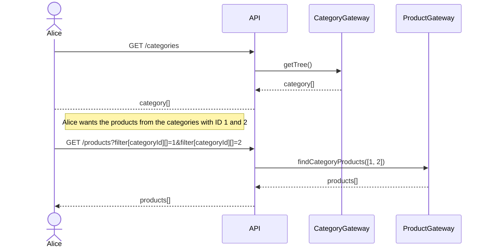

## RF-02: Visualização de produtos e seus fornecedores

**Interpretação**: Visualização da especificação dos produtos [e noutra página] dos fornecedores que vendem essa especificação.
No máximo teríamos um ou dois fornecedores que vendem cada produto na lista de produtos.

A interface irá ser semelhante a:

- Uma lista principal, paginada, de `ProductSpec`, com preço mínimo, máximo, e médio dos fornecedores.
- Após clicar num `ProductSpec`, irá abrir uma página com mais detalhes sobre o `ProductSpec` tais como uma descrição mais detalhada e os valores dos *fields* das categorias. Terá de ter também um botão para comparar com outros produtos. Poderá, eventualmente, ter o histórico dos preços dos diversos fornecedores.
  - Irá ter também a lista de `ProducerProduct`, mostrando o fornecedor e o preço. Ao clicar somos redirecionados para a página do `ProducerProduct`.
- A página do `ProducerProduct` terá o histórico de preços desse produto e outras informações pertinentes, se bem que já deve estar tudo na página do `ProductSpec`, tornando a página atual mais direcionada à compra.

Através do *endpoint* GET `/products` podemos obter os `ProductSpec`.

<!-- TODO bom nome para o endpoint? confuso? ideias? -->
Contudo, para obter todos os `ProducerProduct` (e por consequência os fornecedores) de um `ProductSpec` podemos usar o endpoint `/products/{id}/products` que nos devolve todos os fornecedores que fornecem esse produto.

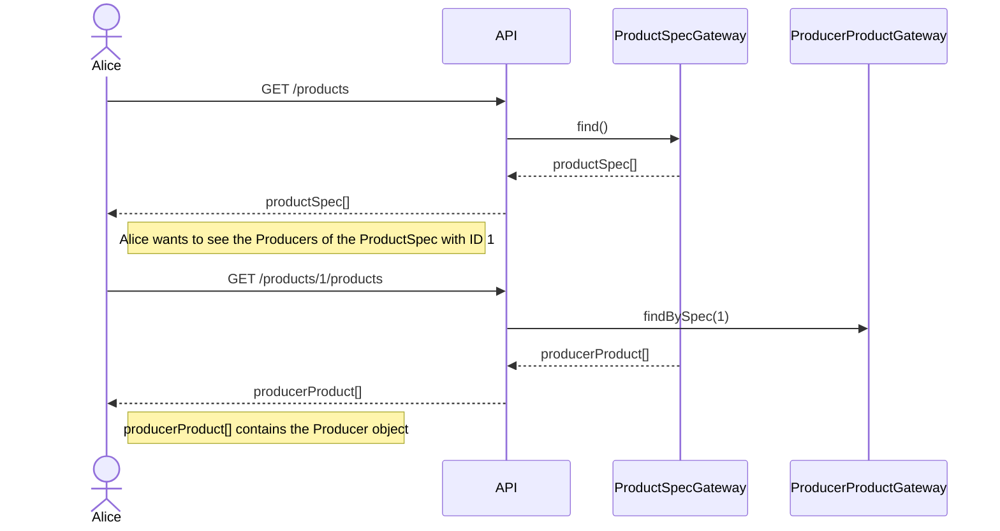

## RF-03: Pesquisa de produtos através dos campos comuns a todos os produtos

<!-- TODO enumerar os campos comuns a todos os produtos -->
Podemos usar o *endpoint* GET `/products/search?q=`, definindo o parâmetro `q` com o termo que queremos pesquisar. A pesquisa será relativa as campos comuns a todos os produtos, sendo estes o nome, TODO completar.

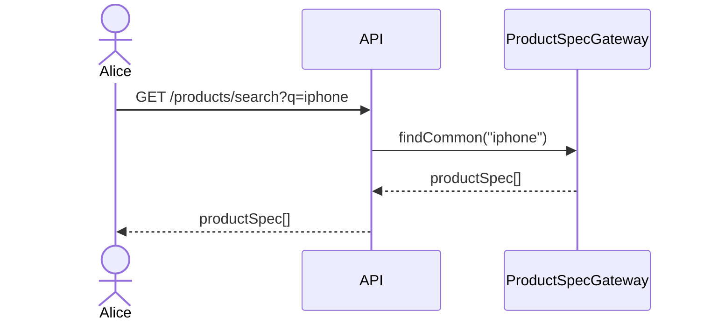

## RF-04: Colocação, consulta, e remoção de produtos num cesto de compra

<!-- TODO endpoints /cart -->
Para colocar um `ProducerProduct` no carrinho de compras podemos usar o endpoint `/consumers/{consumerId}/cart/products/{productId}` com o método `PUT`, em que `productId` é o id do `ProducerProduct` que queremos colocar no carrinho.

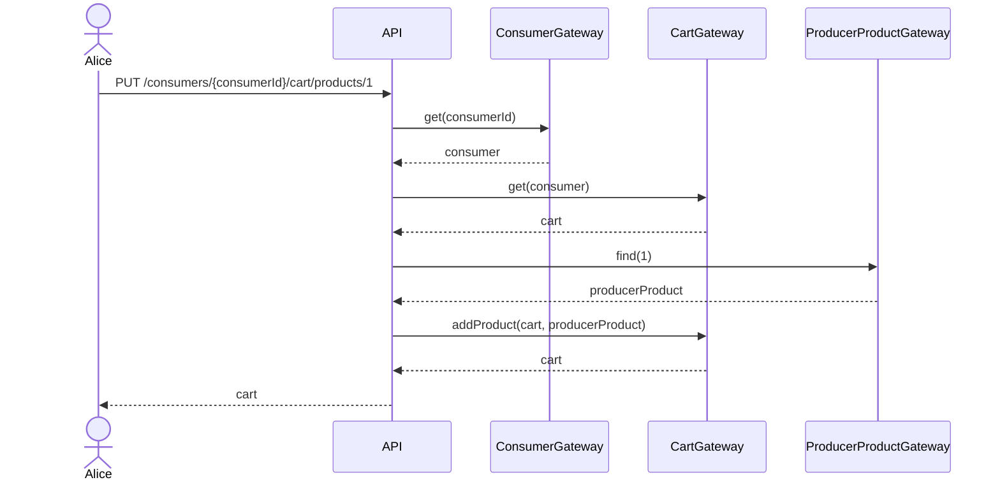

Para consultar os produtos no carrinho podemos usar o endpoint `/consumers/{consumerId}/cart/products` com o método `GET`.

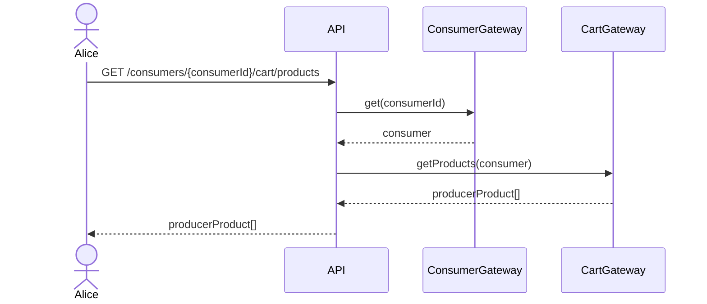

Remover um produto do carrinho é feito através do endpoint `/consumers/{consumerId}/cart/products/{productId}` com o método `DELETE`.

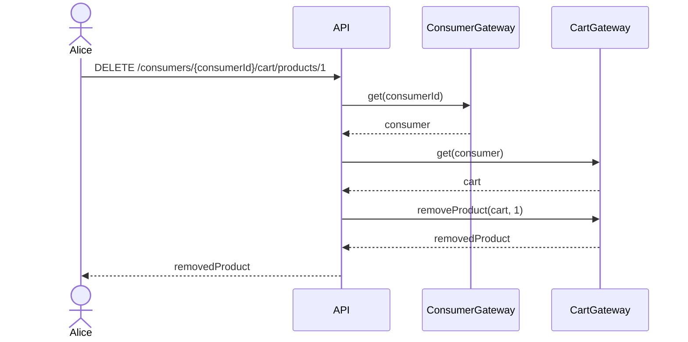

## RF-05: Criação de uma conta no sistema

1. Criar uma conta sem credenciais relacionadas. Feito através dum `POST` a `/consumers` ou `/producers` com os dados necessários, sendo este *endpoint* **não** protegido.
2. Após a criação do utilizador com sucesso, solicitar a adição de uma credencial (dos vários tipos `authType` possíveis: `password`, `google`, `facebook`, `twitter`)
   1. Autenticar o utilizador no serviço externo
   2. Obtenção de um token do serviço externo
   3. Criação da credencial ao utilizador através de `POST` a `/consumers/{consumerId}/credentials` ou `/producers/{producerId}/credentials`, dependendo do tipo de utilizador.

   - Até à adição da credencial, o utilizador ficará num estado em que apenas existe partialmente. Se não adicionarmos uma credencial, o utilizador não se poderá autenticar, ocupando recursos de forma desnecessária.

Iremos apenas contemplar a criação de um `Consumidor`, mas o processo é idêntico para um `Producer`

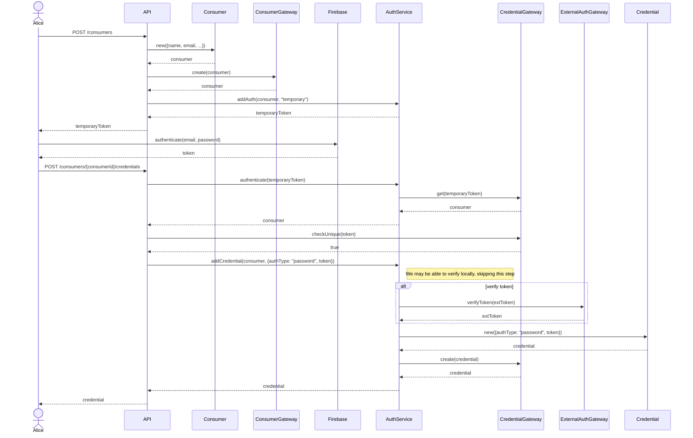

## RF-06: Fazer login no sistema

Autenticar o utilizador no serviço externo através do *frontend* e obter um *token* do serviço externo.

Usar o *endpoint* `/auth/login` com o método `POST`, forneçendo o *token* no *body* de forma a trocá-lo por um *access token* do nosso sistema.

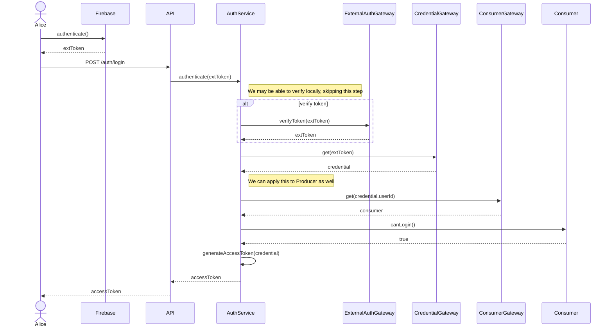

## RF-07: Edição dos dados e remoção da sua conta no sistema

<!-- TODO rever por causa de usar um User (modelo Concrete) -->

O aplicado em `/consumers` é aplicado da mesma forma em `/producers`.

### Edição

Para editar os dados do utilizador podemos usar o *endpoint* `/consumers/{consumerId}` com o método `PUT`.

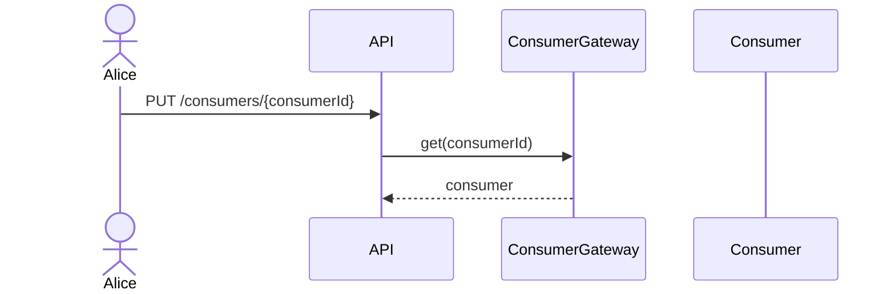

### Remoção

<!-- TODO rever por causa de usar um User (modelo Concrete) -->

Para remover a conta do utilizador podemos usar o *endpoint* `/consumers/{consumerId}` com o método `DELETE`.

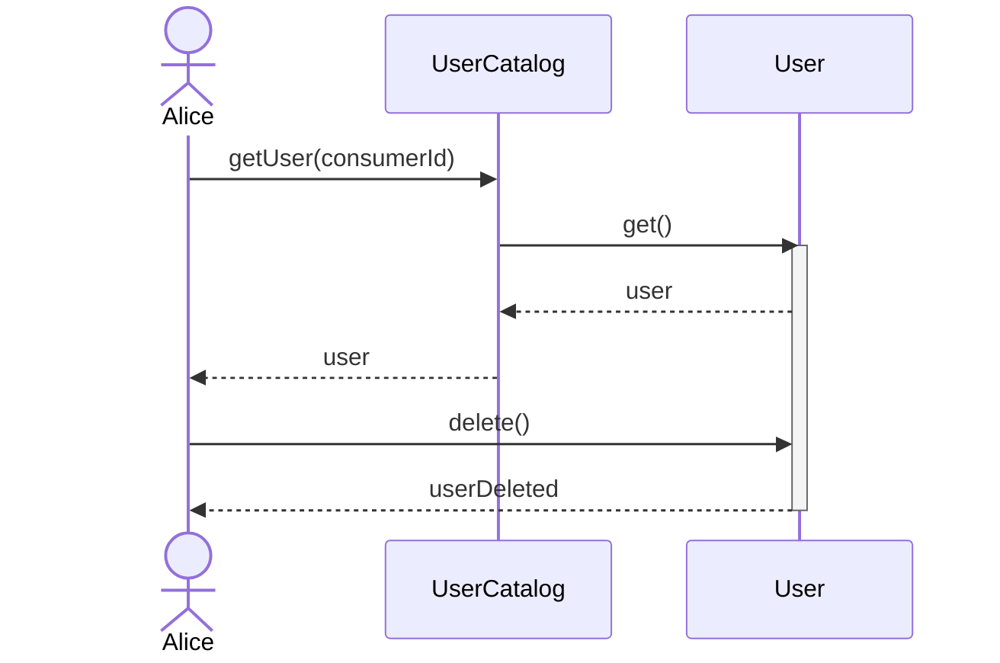

## RF-08: Pesquisa de produtos através dos campos específicos das categorias

Usando o mesmo *endpoint* `/products/search?q=` do [rf-03](#rf-03-pesquisa-de-produtos-através-dos-campos-comuns-a-todos-os-produtos) mas adicionando os campos específicos das categorias.

Ver [notas da api](#notas-sobre-api) para detalhes de utilização de filtros.

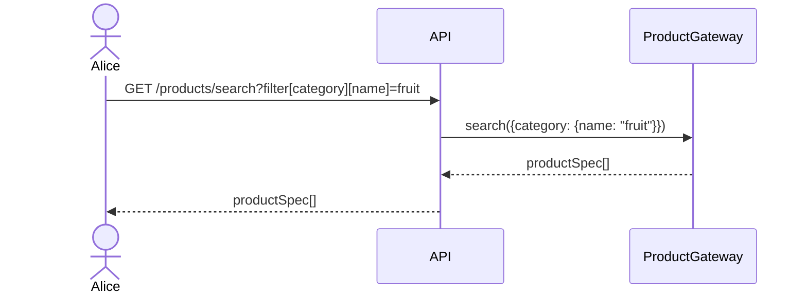

## RF-09: Visualização do histórico de encomendas e seus detalhes

Para obter o histórico de encomendas do utilizador podemos usar o *endpoint* `/consumers/{consumerId}/orders` com o método `GET`.

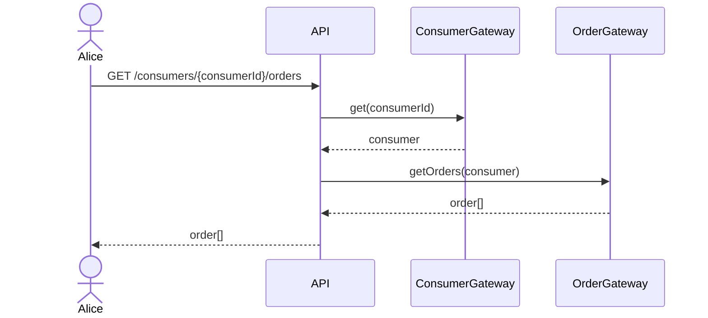

## RF-10: Comparação de dois produtos, com as diferenças em destaque

Obter os dois `ProductSpec` e iterar sobre as propriedades (e valores das categorias) de forma a saber quais diferem em valor.

Devemos definir se é possível comparar dois `ProductSpec` de categorias diferentes.

Convém definir se podemos comparar `ProducerProduct` com `ProducerProduct`, possibilitando comparar o mesmo `ProductSpec` de fornecedores diferentes, `ProductSpec` com `ProductSpec`, ou ambos.

1. Com a primeira podemos comparar custos e impacto na comunidade
    - A especificação da API seria um `GET` a `/producers/{producerId}/products/{product1}/compare/{product2}`.
      - Isto parece estranho porque semânticamente estariamos a comparar produtos de um fornecedor com outro produto do mesmo fornecedor (e não outro produto qualquer)
2. Com a segunda só queremos saber das diferenças da especificação do produto, que nem inclui o preço
    - A especificação da API seria um `GET` a `/products/{product1}/compare/{product2}`.

Podemos implementar ambos, mas acho que o primeiro é mais interessante.

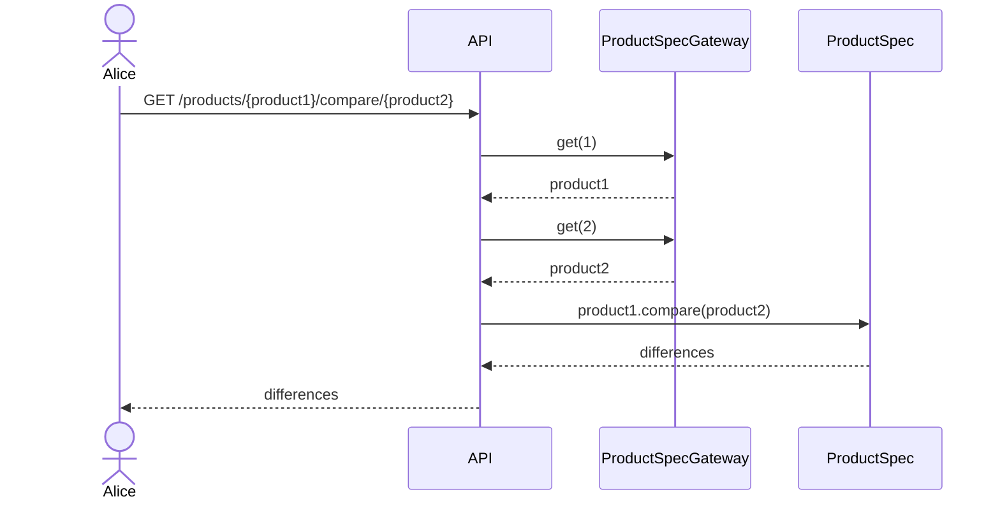

## RF-11: Encomenda dos produtos no cesto de compras

A especificação da API seria um `POST` a `/consumers/{consumerId}/orders` com o *body* a conter o `cartId`.

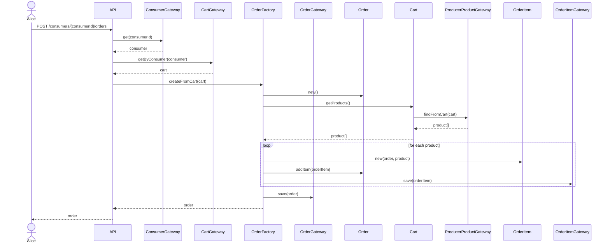

## RF-12: Pagamento de encomenda recorrendo a um sistema externo

Serviço externo: [**Stripe**](https://stripe.com), usando o [**Stripe Checkout**](https://stripe.com/docs/payments/checkout).

Começamos então por fazer um pedido `POST` ao *endpoint* `/consumers/{consumerId}/orders/{orderId}/checkout` irá criar um *checkout session* no *Stripe* e redirecionar o utilizador para o preenchimento de dados relativos ao pagamento, do lado do *Stripe*.

Após a introdução dos dados de pagamento, o *Stripe* irá confirmar o sucesso da operação ao submeter um pedido `POST` a `/payments/webhook`, *aka* *webhook*.

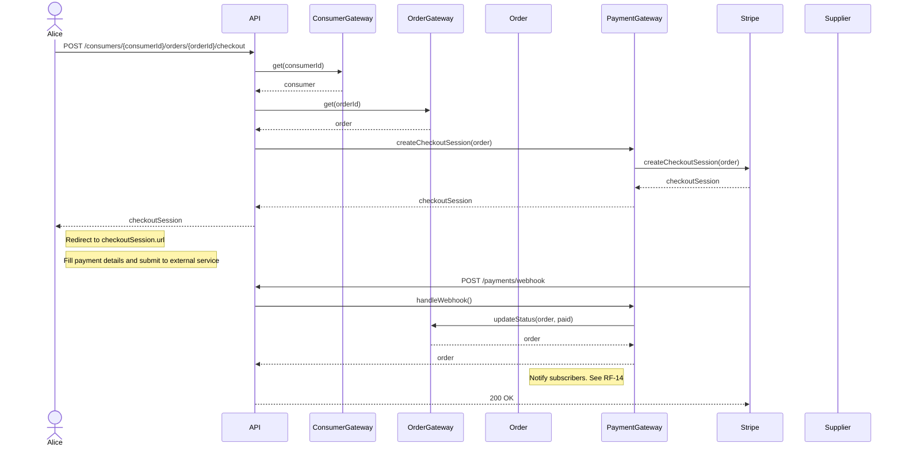

## RF-13: Cancelamento de encomenda, desde que dentro de um dado prazo

A especificação da API seria um `DELETE` a `/consumers/{consumerId}/orders/{orderId}`.

<!-- TODO -->
Importante!!! Falta definir o prazo de cancelamento e outras regras.

Sugeria que o prazo de cancelamento fosse de 24h, mas que o utilizador pudesse cancelar a qualquer momento, desde que o produto ainda não tivesse sido enviado.

Também é possível definir um prazo de cancelamento para cada produto, definido pelo fornecedor, ou fornecedor-wide.

Este requisito será simplificado, i.e., o utilizador apenas pode cancelar encomendas na sua totalidade, não pode cancelar apenas um produto de uma encomenda.

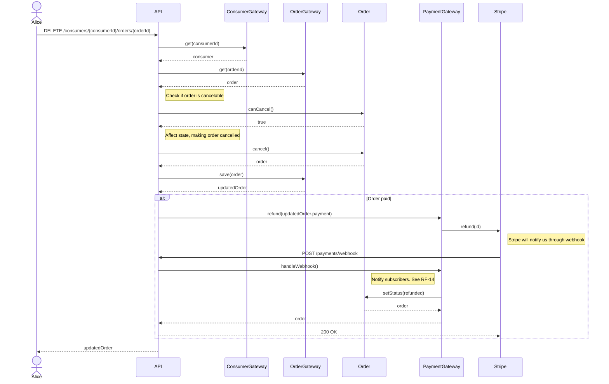

## RF-14: Notificação sobre a saída de produtos encomendados de um fornecedor

**Interpretação**: Notificação a cada `ShipmentEvent` em vez de apenas uma notificação aquando da saída dos produtos de uma `Order`.

Desta forma, não "existe" um *endpoint* para notificar o utilizador sobre a saída de produtos de uma encomenda, mas sim, um evento despoletado. Utilização do padrão ***Observer***?

Primeiramente, necessitamos de persistir as notificações, podendo assim ser vistas novamente posteriormente, e não perdidas (*ephemeral*).

Após isso, devemos notificar as partes interessadas, os *subscribers*. Após persistir a notificação, podemos notificar os *subscribers* de forma assíncrona, i.e., em *background*, através de *sockets* (caso o *subscriber* estiver à escuta), e através do *e-mail*.

Notas de implementação: Uso do padrão ***Strategy*** Criar uma interface `NotificationStrategy` e implementar `SocketNotificationStrategy` assim como `EmailNotificationStrategy` que, através dos `SocketGateway` e `EmailGateway`, respetivamente, notificam os *subscribers*.

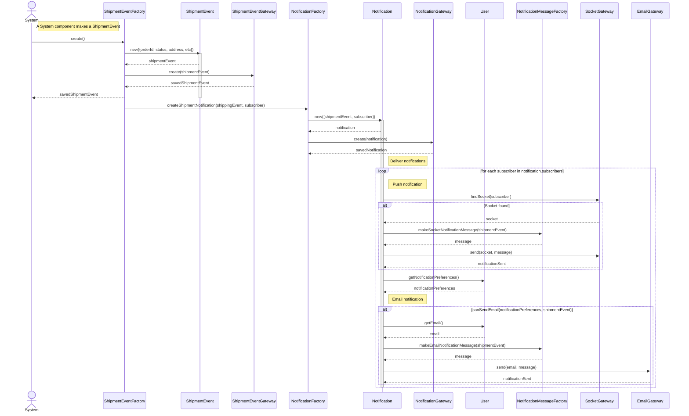

## RF-15: Notificação sobre a chegada iminente de encomenda

Notar o diagrama de sequência [acima](#rf-14-notificação-sobre-a-saída-de-produtos-encomendados-de-um-fornecedor). Visto que o `ShipmentEvent` é um evento que ocorre quando a encomenda tem uma atualização no envio, podemos utilizar o mesmo evento para notificar o utilizador sobre a chegada iminente da encomenda.

## RF-16: Visualização de relatório do impacto local das suas encomenda

Não sei
<!-- TODO não faço ideia -->

## RF-17: Exportação dos dados das encomendas para ficheiros JSON

Um *endpoint* próprio para obter os dados tratados seria o mais eficiente. Depois, apenas seria necessário gravar a resposta num ficheiro (a *API* retorna sempre em *JSON*).

`/consumers/{consumerId}/orders/export`

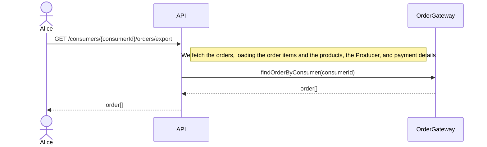

## RF-18: Criação, gestão, e remoção de unidade de produção

É mais simples separar em três partes: criação, gestão, e remoção.

### Criação

A criação de uma unidade de produção é feita através de um *endpoint* próprio, que recebe os dados necessários para a criação da unidade de produção. Para tal, efetua-se `POST` a `/producers/{producerId}/units`

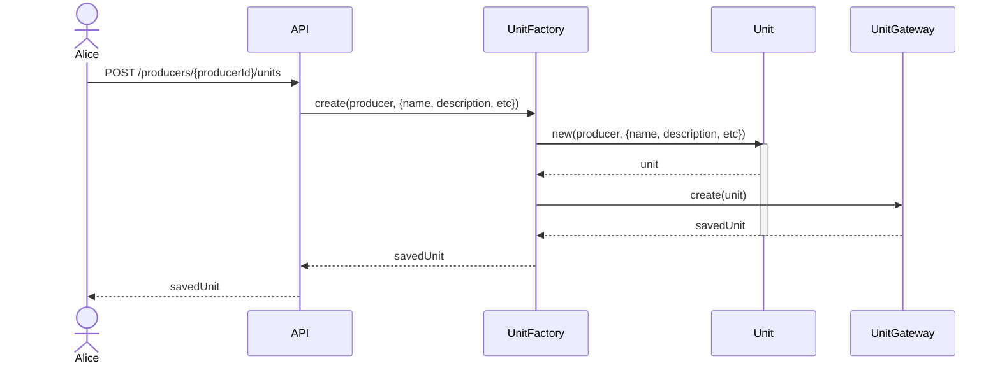

### Gestão

A gestão de uma unidade de produção é feita através de um *endpoint* próprio, que recebe os dados necessários para a gestão da unidade de produção. Para tal, efetua-se `PUT` a `/producers/{producerId}/units/{unitId}`

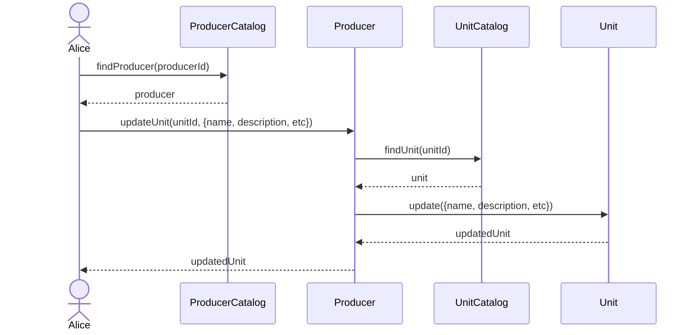

### Remoção

A remoção de uma unidade de produção é feita através de um *endpoint* próprio, que recebe os dados necessários para a remoção da unidade de produção. Para tal, efetua-se `DELETE` a `/producers/{producerId}/units/{unitId}`

```mermaid
sequenceDiagram
    actor A as Alice
    participant UC as UnitCatalog
    participant U as Unit

    A ->> UC: deleteUnit(producerId, unitId)
    UC ->> U: delete()
    U -->> UC: deletedUnit
    UC -->> A: deletedUnit
```

## RF-19: Criação, gestão, e remoção de produto, e ligação a unidade de produção

É mais simples separar em quatro partes: criação, gestão, remoção, e ligação a unidade de produção.

### Criação

De forma semelhante ao [RF-18](#rf-18-criação-gestão-e-remoção-de-unidade-de-produção), a criação de um produto é feita através de um *endpoint* próprio, que recebe os dados necessários para a criação do produto. Para tal, efetua-se `POST` a `/producers/{producerId}/products`

```mermaid
sequenceDiagram
    actor A as Alice
    participant PC as ProducerCatalog
    participant P as Producer
    participant Pr as Product

    A ->> PC: findProducer(producerId)
    PC -->> A: producer

    A ->> P: createProduct({name, description, etc})
    P ->> Pr: new({name, description, etc})
    activate Pr

    Pr ->> Pr: persist()

    Pr -->> P: product

    P -->> A: product
    deactivate Pr
```

### Gestão

De forma semelhante ao [RF-18](#rf-18-criação-gestão-e-remoção-de-unidade-de-produção), a gestão de um produto é feita através de um *endpoint* próprio, que recebe os dados necessários para a gestão do produto. Para tal, efetua-se `PUT` a `/producers/{producerId}/products/{productId}`

```mermaid
sequenceDiagram
    actor A as Alice
    participant PC as ProducerCatalog
    participant P as Producer
    participant PrC as ProductCatalog
    participant Pr as Product
    participant PrP as ProductPricing

    A ->> PC: findProducer(producerId)
    PC -->> A: producer

    A ->> P: updateProduct(productId, {name, description, etc})

    P ->> PrC: findProduct(productId)
    PrC -->> P: product

    P ->> Pr: update({name, description, etc})

    alt price is changed
        Pr ->> PrP: new({productId, currentPrice})
        activate PrP
        PrP ->> PrP: persist()
        PrP -->> Pr: productPricing
        deactivate PrP

        Note right of Pr: price = currentPrice
    end

    Pr -->> P: updatedProduct
    P -->> A: updatedProduct
```

### Remoção

De forma semelhante ao [RF-18](#rf-18-criação-gestão-e-remoção-de-unidade-de-produção), a remoção de um produto é feita através de um *endpoint* próprio, que recebe os dados necessários para a remoção do produto. Para tal, efetua-se `DELETE` a `/producers/{producerId}/products/{productId}`

```mermaid
sequenceDiagram
    actor A as Alice
    participant PC as ProducerCatalog
    participant P as Producer
    participant UC as UnitCatalog
    participant U as Unit

    A ->> PC: findProducer(producerId)
    PC -->> A: producer

    A ->> P: removeProduct(unitId, productId)

    P ->> UC: findUnit(unitId)
    UC -->> P: unit
    
    P ->> U: removeProduct(product)
    U -->> P: removedProduct

    P -->> A: removedProduct
```

### Ligação a unidade de produção

Para ligar um produto a uma unidade de produção é necessário que ambos tenham sido criados previamente. Depois, resta apenas adicionar o produto à coleção de produtos da unidade, através de `PUT` a `/producers/{producerId}/units/{unitId}/products/{productId}`

```mermaid
sequenceDiagram
    actor A as Alice
    participant PC as ProducerCatalog
    participant P as Producer
    participant UC as UnitCatalog
    participant PrC as ProductCatalog
    participant U as Unit

    A ->> PC: findProducer(producerId)
    PC -->> A: producer

    A ->> P: addProductToUnit(unitId, productId)

    P ->> UC: findUnit(unitId)
    UC -->> P: unit

    P ->> PrC: findProduct(productId)
    PrC -->> P: product

    P ->> U: addProduct(product)
    U -->> P: unit

    P -->> A: unit
```

## RF-20: Visualização de unidade de produção e dos seus produtos

Iremos novamente separar em duas partes: visualização de unidade de produção, e visualização dos produtos da unidade de produção.

### Visualização de unidade de produção

Apenas obtém os dados base da unidade de produção, através de `GET` a `/producers/{producerId}/units/{unitId}`

```mermaid
sequenceDiagram
    actor A as Alice
    participant UC as UnitCatalog

    A ->> UC: findUnit(producerId, unitId)
    UC -->> A: unit
```

### Visualização dos produtos da unidade de produção

<!-- TODO este endpoint -->
De forma a obter a coleção de produtos da unidade de produção, efetua-se `GET` a `/producers/{producerId}/units/{unitId}/products`

```mermaid
sequenceDiagram
    actor A as Alice
    participant UC as UnitCatalog
    participant U as Unit

    A ->> UC: findUnit(producerId, unitId)
    UC -->> A: unit

    A ->> U: listProducts()
    U -->> A: products
```

## RF-21: Criação, edição, e remoção de veículo de transporte de produtos

Bastante semelhante a [RF-18](#rf-18-criação-gestão-e-remoção-de-unidade-de-produção).

Separando em três partes: criação, gestão, e remoção.

### Criação

De forma semelhante ao [RF-18](#rf-18-criação-gestão-e-remoção-de-unidade-de-produção), a criação de um veículo de transporte de produtos é feita através de um `POST` a `/producers/{producerId}/carriers`

```mermaid
sequenceDiagram
    actor A as Alice
    participant PC as ProducerCatalog
    participant P as Producer
    participant C as Carrier

    A ->> PC: findProducer(producerId)
    PC -->> A: producer

    A ->> P: createCarrier({name, description, etc})
    P ->> C: new({name, description, etc})
    activate C

    C ->> C: persist()

    C -->> P: carrier

    P -->> A: carrier
    deactivate C
```

### Edição

De forma semelhante ao [RF-18](#rf-18-criação-gestão-e-remoção-de-unidade-de-produção), a edição de um *carrier* faz-se através de um `PUT` a `/producers/{producerId}/carriers/{carrierId}`

```mermaid
sequenceDiagram
    actor A as Alice
    participant CC as CarrierCatalog
    participant C as Carrier

    A ->> CC: findCarrier(producerId, carrierId)
    CC -->> A: carrier

    A ->> C: update({name, description, etc})
    C -->> A: updatedCarrier
```

### Remoção

De forma semelhante ao [RF-18](#rf-18-criação-gestão-e-remoção-de-unidade-de-produção), a remoção de um *carrier* faz-se através de um `DELETE` a `/producers/{producerId}/carriers/{carrierId}`

```mermaid
sequenceDiagram
    actor A as Alice
    participant PC as ProducerCatalog
    participant C as Carrier

    A ->> CC: deleteCarrier(producerId, carrierId)
    CC ->> C: delete()
    C -->> CC: deletedCarrier
    CC -->> A: deletedCarrier
```

## RF-22: Notificação sobre encomenda de consumidor

Podemos usar o mesmo evento `ShipmentEvent` para notificar o utilizador sobre a criação de uma encomenda.

Assim, iriamos ter um `ShipmentEvent` criado, cujo `ShipmentStatus` seria encomenda `criada`, porém `pending` seria mais rigoroso.

> Notar o diagrama de sequência [acima](#rf-14-notificação-sobre-a-saída-de-produtos-encomendados-de-um-fornecedor). Visto que o `ShipmentEvent` é um evento que ocorre quando a encomenda tem uma atualização no envio, podemos utilizar o mesmo evento para notificar o utilizador sobre a chegada iminente da encomenda.

## RF-23: Visualização de encomenda de consumidor

<!-- standard -->

A visualização de uma encomenda de consumidor é feita através de um `GET` a `/consumers/{consumerId}/orders/{orderId}`

```mermaid
sequenceDiagram
    actor A as Alice
    participant API as API
    participant CG as ConsumerGateway
    participant OG as OrderGateway
    participant O as Order

    A ->> API: GET /consumers/{consumerId}/orders/{orderId}

    API ->> CG: get(consumerId)
    CG -->> API: consumer

    API ->> OG: get(orderId)
    OG -->> API: order
    API -->> A: order
```

## RF-24: Colocação de produto encomendado em veículo de transporte disponível

TODO

## RF-25: Registo de saída de veículo de transporte com produtos encomendados

Basicamente o mesmo que o [RF-14](#rf-14-notificação-sobre-a-saída-de-produtos-encomendados-de-um-fornecedor), mas com um `ShipmentStatus` diferente.

## RF-26: Registo de chegada iminente de encomenda a casa do consumidor

Basicamente o mesmo que o [RF-14](#rf-14-notificação-sobre-a-saída-de-produtos-encomendados-de-um-fornecedor), mas com um `ShipmentStatus` diferente.

## RF-27: Visualização de relatório do impacto local das vendas dos seus produtos

Não sei

## RF-28: Desativação e reativação de qualquer conta de utilizador no sistema

De forma semelhante ao [RF-18](#rf-18-criação-gestão-e-remoção-de-unidade-de-produção), a desativação de uma conta de utilizador faz-se através de um `PUT` a `/users/{userId}`, especificando o campo `disabledOn` com a data a partir da qual a conta fica desativada ou `null`, de forma a reativar a conta.

```mermaid
sequenceDiagram
    actor A as Alice
    participant API
    participant UG as UserGateway
    participant U as User

    A ->> API: PUT /users/{userId}

    API ->> UG: get(userId)
    UG -->> API: user

    API ->> U: update({disabledOn: body.disabledOn})
    U -->> API: disabledUser

    API ->> UG: update(disabledUser)
    UG -->> API: updatedUser

    API -->> A: updatedUser
```

## RF-29: Visualização de relatório do impacto local das vendas de produtos

Não sei
