# Diagramas de Sequência

## RF-01 - Navegação pelos produtos através da hierarquia de categorias

<!-- TODO isto em árvore? É muito custoso na BD gerar isto? Caching? -->
Na API temos o endpoint `/categories` para obter as categorias na sua forma hierarquica.

<!-- TODO ter a certeza desta forma, ou se faremos algo tipo /products?categoryId=1,2 -->
Podemos então selecionar as categorias que queremos visualizar e filtrar os produtos pelos IDs dessas categorias no endpoint `/products?categoryId=1&categoryId=2`

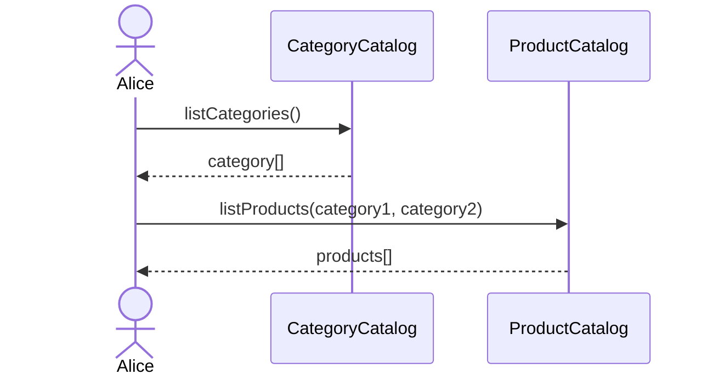

## RF-02: Visualização de produtos e seus fornecedores

Através do endpoint `/products` podemos obter os produtos, que terão no seu interior o fornecedor.

<!-- TODO este endpoint -->
Contudo, para obter todos os fornecedores de um `ProductSpec` podemos usar o endpoint `/products/{id}/suppliers` que nos devolve todos os fornecedores que fornecem esse produto.

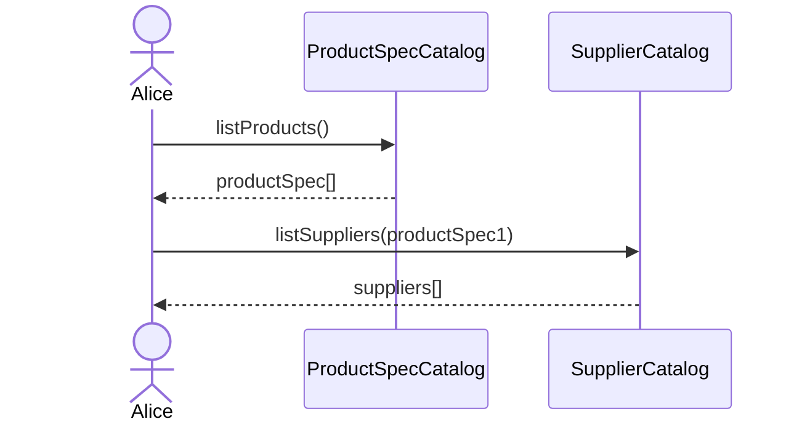

## RF-03: Pesquisa de produtos através dos campos comuns a todos os produtos

<!-- TODO enumerar os campos comuns a todos os produtos -->
Podemos usar o endpoint `/products/search?q=` definindo o parâmetro `q` com o termo que queremos pesquisar. A pesquisa será relativa as campos comuns a todos os produtos.

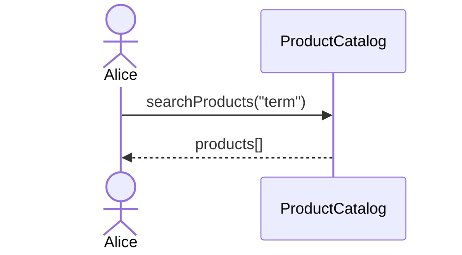

## RF-04: Colocação, consulta, e remoção de produtos num cesto de compra

<!-- TODO endpoints /cart -->
Para colocar um produto no carrinho de compras podemos usar o endpoint `/cart/@me/products/{productId}` com o método `PUT`, em que `productId` é id do produto que queremos colocar no carrinho.

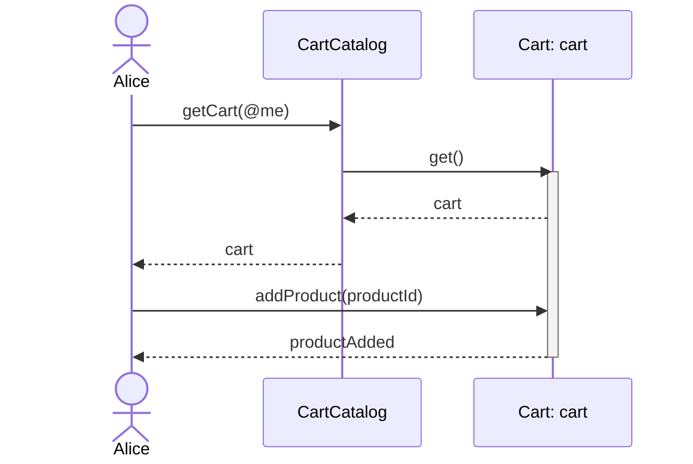

Para consultar os produtos no carrinho podemos usar o endpoint `/cart/@me/products` com o método `GET`.

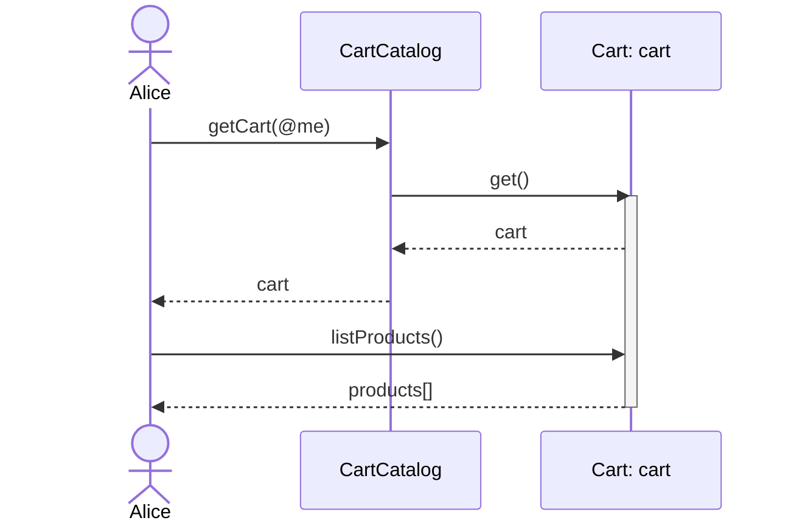

Remover um produto do carrinho é feito através do endpoint `/cart/@me/products/{productId}` com o método `DELETE`.

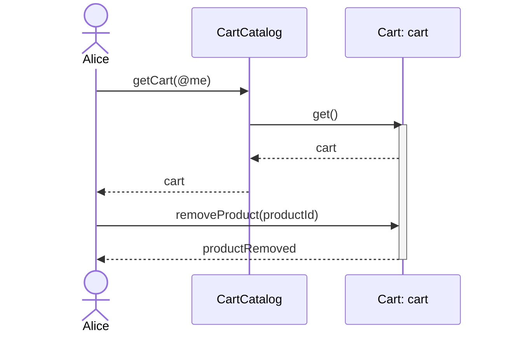

## RF-05: Criação de uma conta no sistema

### Opção 1

<!-- TODO desta forma temos os campos todos a null???? 
deveriamos antes fazer uma tabela de credenciais? mas aí teriamos de permitir que a FK utilizador seja nulável -->
1. O utilizador tem de se registar. Como utilizamos um sistema externo de autenticação, temos de usar o *endpoint* `/auth/login` que irá criar uma credencial no sistema e *autenticar* o utilizador.
<!-- TODO escrever sobre isto na API.
Tem de permitir que um Admin crie contas para outros utilizadores. Passar o token no body? -->
2. O utilizador tem de criar a sua conta. Para isto temos de usar o endpoint `/users` com o método `POST`. Este *endpoint* é protegido, por isso temos de usar o *access token* obtido anteriormente.

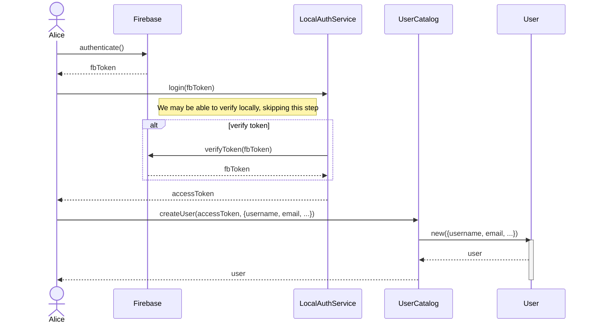

### Opção 2

1. Criar uma conta sem credenciais relacionadas. Feito através dum `POST` a `/users` com os dados necessários, sendo este *endpoint* **não** protegido.
2. Após a criação do utilizador com sucesso, solicitar a adição de uma credencial (dos vários tipos `authType` possíveis: `password`, `google`, `facebook`, `twitter`)
   1. Autenticar o utilizador no serviço externo
   2. Obtenção de um token do serviço externo
   3. Adição da credencial ao utilizador através de `PUT` a `/users/@me/credentials/{authType}`

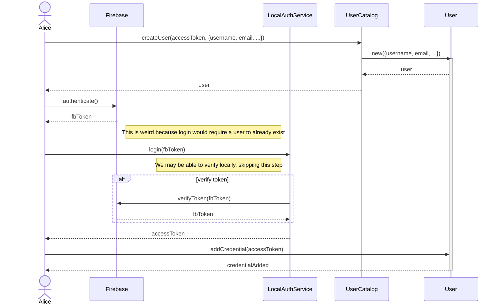

## RF-06: Fazer login no sistema

Autenticar o utilizador no serviço externo através do *frontend* e obter um *token* do serviço externo.

Usar o *endpoint* `/auth/login` com o método `POST`, forneçendo o *token* no *body* de forma a trocá-lo por um *access token* do nosso sistema.

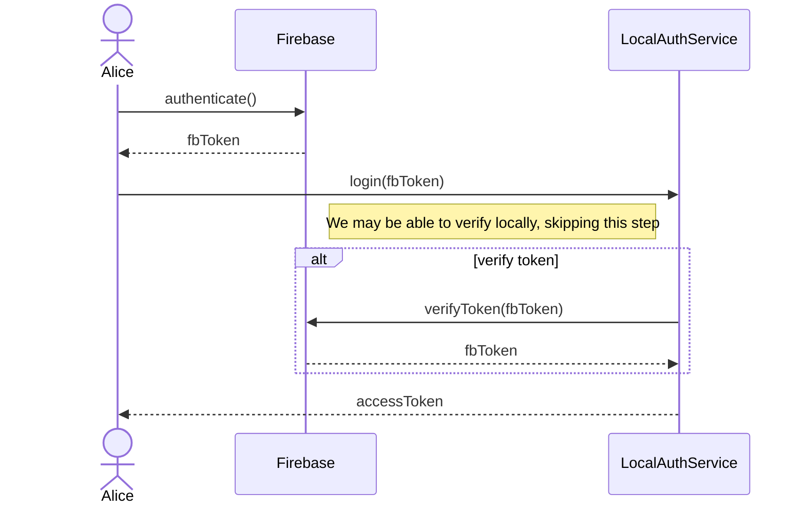

## RF-07: Edição dos dados e remoção da sua conta no sistema

Para editar os dados do utilizador podemos usar o *endpoint* `/users/@me` com o método `PUT`.

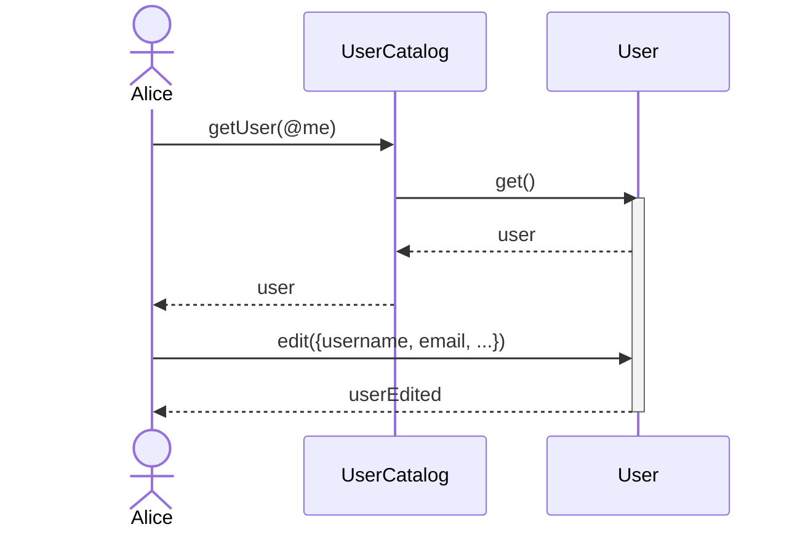

Para remover a conta do utilizador podemos usar o *endpoint* `/users/@me` com o método `DELETE`.

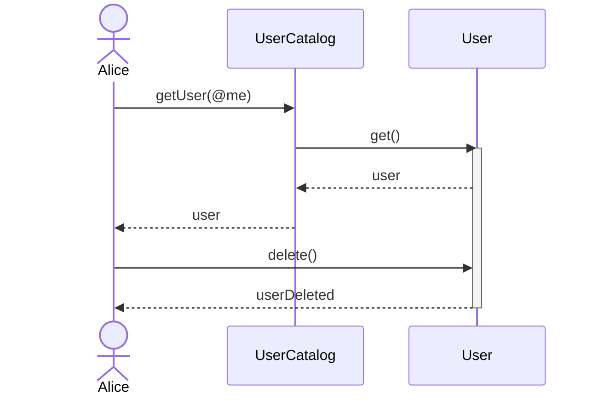

## RF-08: Pesquisa de produtos através dos campos específicos das categorias

<!-- TODO -->
esta tá chata de definir na API, mas é importante

## RF-09: Visualização do histórico de encomendas e seus detalhes

## RF-10: Comparação de dois produtos, com as diferenças em destaque

Obter os dois `ProductSpec` e iterar sobre as propriedades (e valores das categorias) de forma a saber quais diferem em valor.

Devemos definir se é possível comparar dois `ProductSpec` de categorias diferentes.

Convém definir se podemos comparar `Product` com `Product`, possibilitando comparar o mesmo `ProductSpec` de fornecedores diferentes, ou se tem de ser `ProductSpec` com `ProductSpec`

1. Com a primeira podemos comparar custos e impacto na comunidade
    - A especificação da API seria um `GET` a `/producers/{producerId}/products/{product1}/compare/{product2}`.
1. Com a segunda só queremos saber das diferenças da especificação do produto, que nem inclui o preço
    - A especificação da API seria um `GET` a `/products/{product1}/compare/{product2}`.

Podemos implementar ambos, mas acho que o primeiro é mais interessante.

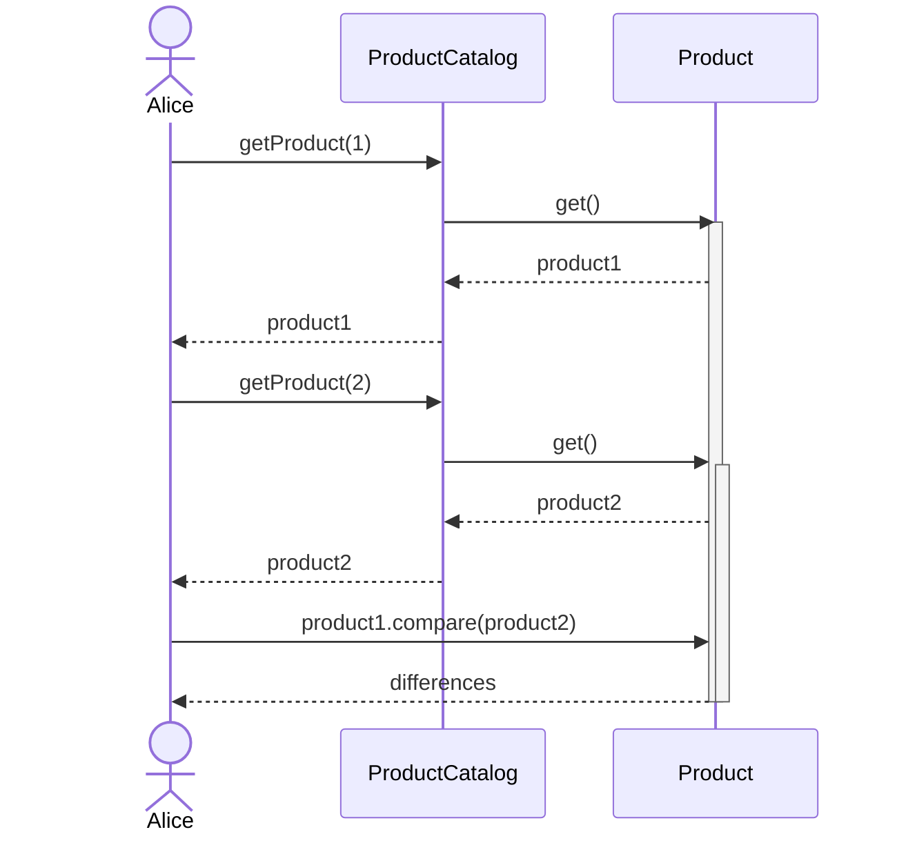

## RF-11: Encomenda dos produtos no cesto de compras

A especificação da API seria um `POST` a `/orders` com o *body* a conter o `userId` e o `cartId`.

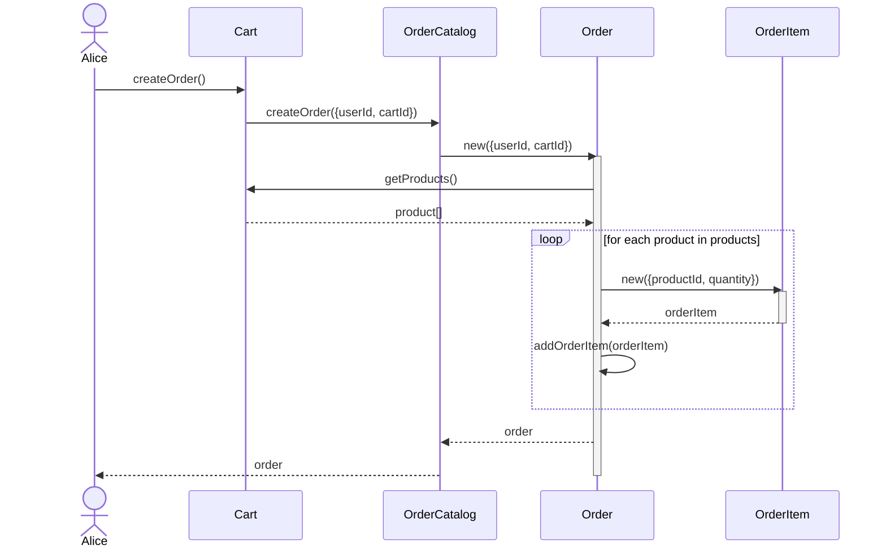

## RF-12: Pagamento de encomenda recorrendo a um sistema externo

Serviço externo: [**Stripe**](https://stripe.com), usando o [**Stripe Checkout**](https://stripe.com/docs/payments/checkout).

Começamos então por fazer um pedido `POST` ao *endpoint* `/orders/{orderId}/checkout` irá criar um *checkout session* no *Stripe* e redirecionar o utilizador para o preenchimento de dados relativos ao pagamento, do lado do *Stripe*.

Após a introdução dos dados de pagamento, o *Stripe* irá confirmar o sucesso da operação ao submeter um pedido `POST` a `/payments/webhook`, *aka* *webhook*.

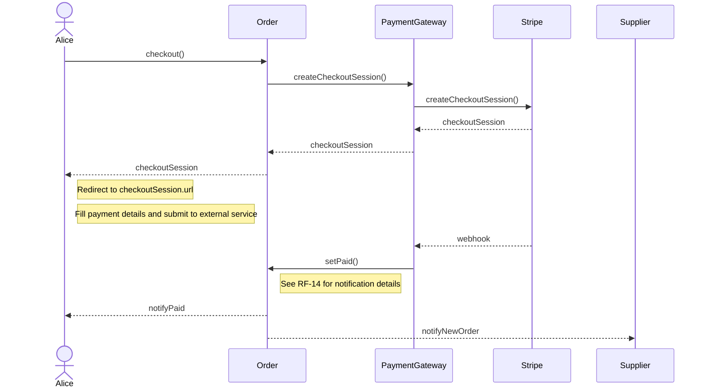

## RF-13: Cancelamento de encomenda, desde que dentro de um dado prazo

A especificação da API seria um `DELETE` a `/orders/{orderId}`.

Importante!!! Falta definir o prazo de cancelamento e outras regras.

Sugeria que o prazo de cancelamento fosse de 24h, mas que o utilizador pudesse cancelar a qualquer momento, desde que o produto ainda não tivesse sido enviado.

Também é possível definir um prazo de cancelamento para cada produto, definido pelo fornecedor, ou fornecedor-wide.

Este requisito será simplificado, i.e., o utilizador apenas pode cancelar encomendas na sua totalidade, não pode cancelar apenas um produto de uma encomenda.

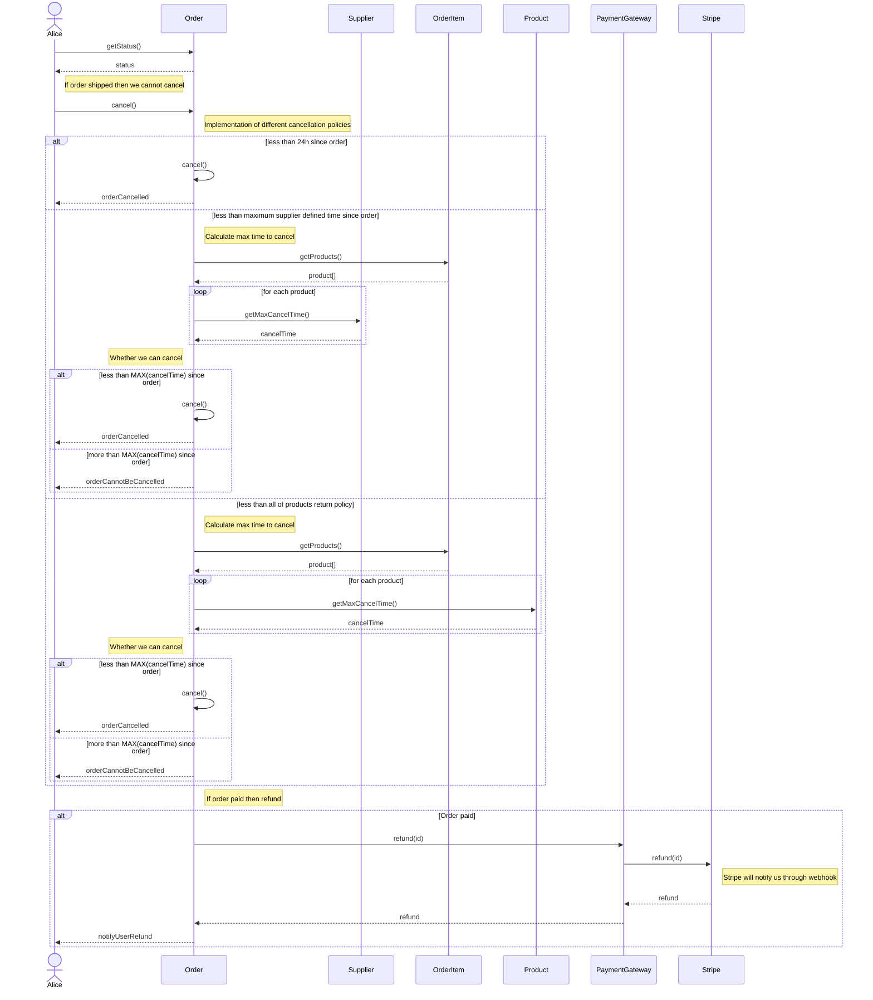

## RF-14: Notificação sobre a saída de produtos encomendados de um fornecedor

**Interpretação**: Notificação a cada `ShipmentEvent` em vez de apenas uma notificação aquando da saída dos produtos de uma `Order`.

Desta forma, não "existe" um *endpoint* para notificar o utilizador sobre a saída de produtos de uma encomenda, mas sim, um evento despoletado. Utilização do padrão ***Observer***?

Primeiramente, necessitamos de persistir as notificações, podendo assim ser vistas novamente posteriormente, e não perdidas (*ephemeral*).

Após isso, devemos notificar as partes interessadas, os *subscribers*. Após persistir a notificação, podemos notificar os *subscribers* de forma assíncrona, i.e., em *background*, através de *sockets* (caso o *subscriber* estiver à escuta), e através do *e-mail*.

Notas de implementação: Uso do padrão ***Strategy*** Criar uma interface `NotificationStrategy` e implementar `SocketNotificationStrategy` assim como `EmailNotificationStrategy` que, através dos `SocketGateway` e `EmailGateway`, respetivamente, notificam os *subscribers*.

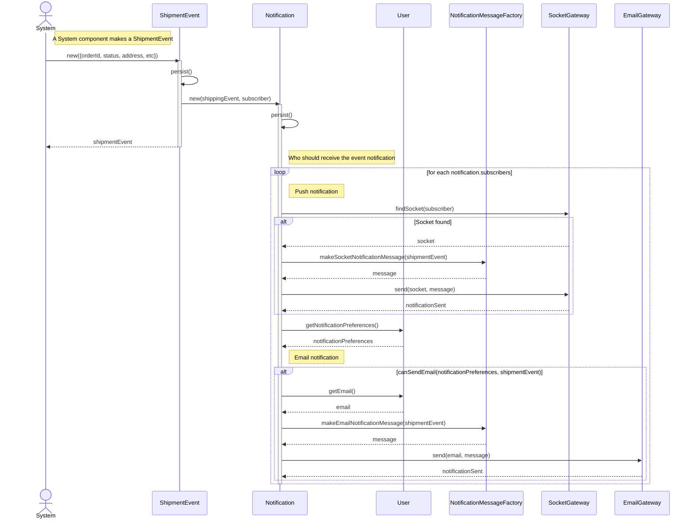

## RF-15: Notificação sobre a chegada iminente de encomenda

Notar o diagrama de sequência acima. Visto que o `ShipmentEvent` é um evento que ocorre quando a encomenda tem uma atualização no envio, podemos utilizar o mesmo evento para notificar o utilizador sobre a chegada iminente da encomenda.

## RF-16: Visualização de relatório do impacto local das suas encomenda

## RF-17: Exportação dos dados das encomendas para ficheiros JSON

## RF-18: Criação, gestão, e remoção de unidade de produção

## RF-19: Criação, gestão, e remoção de produto, e ligação a unidade de produção

## RF-20: Visualização de unidade de produção e dos seus produtos

## RF-21: Criação, edição, e remoção de veículo de transporte de produtos

## RF-22: Notificação sobre encomenda de consumidor

## RF-23: Visualização de encomenda de consumidor

## RF-24: Colocação de produto encomendado em veículo de transporte disponível

## RF-25: Registo de saída de veículo de transporte com produtos encomendados

## RF-26: Registo de chegada iminente de encomenda a casa do consumidor

## RF-27: Visualização de relatório do impacto local das vendas dos seus produtos

## RF-28: Desativação e reativação de qualquer conta de utilizador no sistema

## RF-29: Visualização de relatório do impacto local das vendas de produtos
